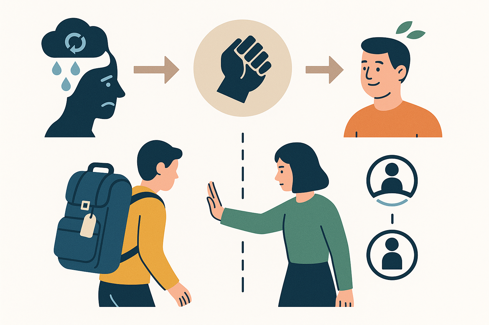
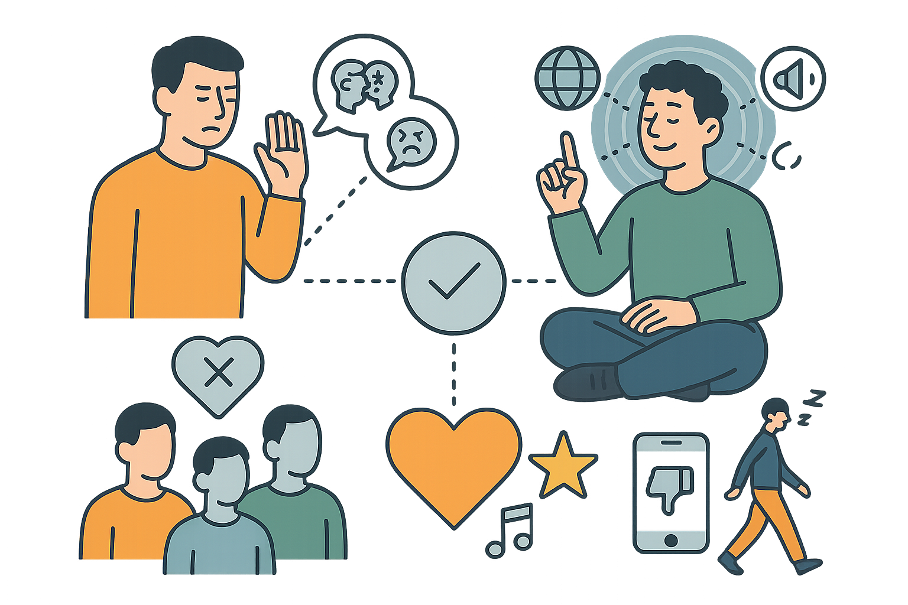
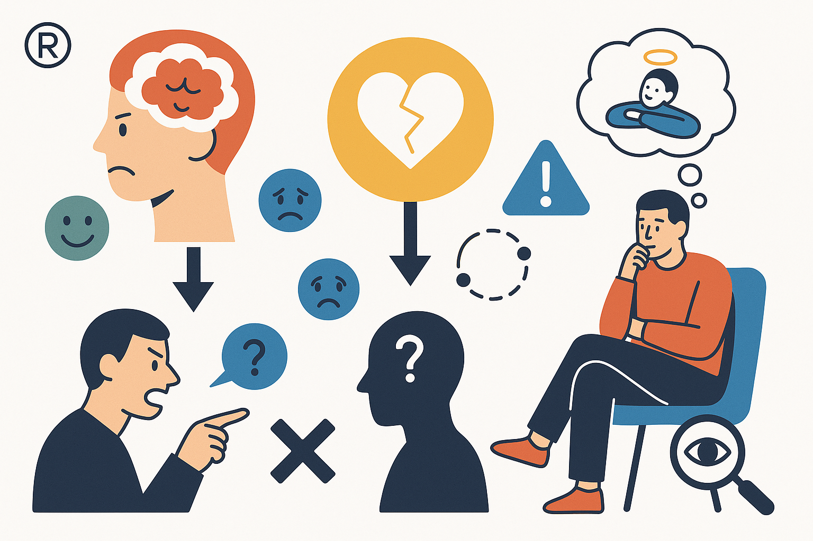

# 「自己中」のススメ

## 〜モヤモヤ世代の閉塞感を打ち破る思考法〜

## はじめに：モヤモヤを希望に変える「あたらしい自己中」

「なんだか、すっきりしない」「特に理由はないけれど、気分が晴れない」
そんな感覚を抱えながら、毎日を送ってはいませんか？

生活に困窮しているわけではない。仕事や友人がいないわけでもない。物質的には満たされているはずなのに、心にはどうしても拭えない **「モヤモヤ」** がある……。
そう感じている方は、決して少なくないのではないでしょうか。

SNS を開けば、誰かの充実した日常が目に入り、将来のことを考えれば、漠然とした不安が心をよぎる。周りの目を気にするあまり、いつしか「本当の自分」を抑えがちになってしまう。そんな経験はありませんか？ 「常識」や「普通」とされる生き方に自分を合わせようとするうちに、自分が本当に何を望んでいるのか、わからなくなってしまう。

現代の日本、特に 20 代や 30 代の方々の中には、こうした**言葉にしがたい「閉塞感」を感じている人が多くいる**ように思います。

もし、この息苦しさから抜け出し、自分らしい希望を見つけるためのヒントが、多くの人がどちらかというとネガティブに捉えがちな「自己中」という考え方の中にあるとしたら、どうでしょう？

「自己中というと、やはり身勝手なイメージがあるのですが…」
そう思われるのも無理はありません。

しかし、ここで私が提案したいのは、そうした自己中心性とは一線を画す **「あたらしい自己中」 という概念**です。それは、他人の評価や期待といった外部の基準に自分の人生を左右されることなく、自分自身の内なる声に真摯に耳を傾け、自分の価値観に基づいて、自分の人生の主導権をしっかりと握るための思考法であり、生き方そのものとも言えます。

情報が溢れ、多様な価値観が交錯し、「唯一の正解」が見えにくくなった現代。変化のスピードが速く、将来の予測も難しい時代。だからこそ、外部の状況や他人の意見に流されずに、揺るぎない「自分軸」を持つことが、これまで以上に大切になってきています。この「あたらしい自己中」を身につけることこそが、私たちが抱える閉塞感を打ち破り、未来への希望を自ら切り拓く力になる、と私は確信しています。

何を隠そう、私自身もかつては人間関係や将来のことで深く悩み、生きづらさを感じていた時期がありました。しかし、アドラー心理学をはじめとする様々な考え方に触れ、 **「自分の課題」と「他人の課題」** を意識的に分けて捉え、自分にできることに集中するようになってから、心が驚くほど軽くなり、以前よりもずっと楽に、前向きに生きられるようになったという経験があります。この実体験を通して、「自己中心的」という言葉が持つ本来の（あるいは、持つべき）ポジティブな側面、つまり **「自分に集中し、自分の人生に責任を持つ」ことの重要性** を痛感したのです。

そういえば、小説家の村上春樹さんは、かつてエッセイか何かで **「人々は闇の中から出てくる何かを見つけることで闇の中から救われることができる」** という趣旨のことを書いていました。私たちが抱えるこの「モヤモヤ」や「閉塞感」も、一種の「闇」のようなものかもしれません。ただその中に留まっていても、なかなか出口は見えません。しかし、その闇の中で、自分自身と向き合い、何か新しい視点や考え方、あるいは自分だけの小さな希望のようなものを自ら「見つけ出す」ことができたなら…？

この本が、あなたの人生を劇的に変える特効薬になる、とは約束できません。ですが、あなたが抱える「闇」の正体を理解するための一助となり、「あたらしい自己中」という、そこから抜け出すための「何か」を見つけるための新しい視点や思考のツールを提供することはできると思っています。
そして、この本を読み終えた時、あなたがほんの少しでも「もう少し、自分の感覚を信じて生きてみようかな」「完璧じゃなくてもいい、何か小さなことから試してみよう」と感じ、自分らしい一歩を踏み出すための、そんなささやかな「きっかけ」になれたら、著者としてこれ以上の喜びはありません。

この先、そのための具体的な考え方やヒントを、私の経験も交えながらお伝えしていきます。
この本と共に、その一歩を踏み出すかどうか。最終的にそれを決めるのは、他の誰でもない、あなた自身です。

 
 
 

## 目次

**はじめに：モヤモヤを希望に変える「あたらしい自己中」**

---

**第 1 部：「自己中」への誤解を解き、本当の意味を知る**

**第 1 章：なぜ、私たちは「モヤモヤ」するのか？――現代ニッポンと若者の閉塞感**

- 「みんなと同じ」を求められる息苦しさ
- SNS 時代の過剰な他者比較と承認欲求
- 将来への漠然とした不安の正体
- 「空気を読む」文化の功罪

**第 2 章：「自己中心的」は悪くない――誤解だらけの言葉を再定義する**

- 「自己中」と「わがまま」はどう違うのか？
- 世間の目に縛られず、自分の心の声に従うということ
- 私が「自己中心的思考」で救われた体験談（アドラー心理学との出会い）
- 「あたらしい自己中」＝自分軸で生きる力

**第 3 章：その悩み、本当にあなたのもの？――アドラー心理学「課題の分離」という革命**

- あなたを悩ませるものは何か？――悩みの正体を探る
- 「これは誰の課題か？」――課題の分離、基本の考え方
- 対人関係の悩みが９割減る！？――課題の分離がもたらす劇的変化
- 期待に応えない勇気、期待しない自由

---

**第 2 部：「あたらしい自己中」を実践するための思考法**

**第 4 章：他人は「課題外」――自分の世界に集中する技術**

- 批判や噂話に心を乱されない方法
- 「みんなちがって、みんどうでもいい」の境地へ
- 自分の「好き」を貫く「自己中力」の育て方
- 「くだらない」と感じることから撤退する勇気

**第 5 章：「いま、ここ」に全力投球――過去と未来への執着を手放す**

- 過去の後悔と未来への不安という「重荷」
- 仏教の教えに学ぶ「現在」の価値
- 変えられるのは「いま、ここ」の自分だけ
- 「いま、ここ」への集中が人生を豊かにする

**第 6 章：怒りの正体は「自分への嘘」――感情に振り回されない思考法**

- その怒りの「下」には何がある？――怒りは二次感情
- 怒りと「課題の分離」――それは本当に「相手」の問題か？
- 「自分への嘘」が怒りを生むメカニズム
- 怒りを「サイン」として読み解き、自分に正直になる

**第 7 章：期待しない、応えない――軽やかに生きるための人間関係術**

- 承認欲求との上手な付き合い方
- 「誰かの期待に応える人生」からの卒業
- 期待を手放すことで得られる本当の信頼関係
- 「与える」ことから始める新しい関係性

---

**第 3 部：未来を切り拓くための武器と習慣**

**第 8 章：限界突破の鍵はテクノロジー――AI・ブロックチェーン時代の生存戦略**

- なぜ、テクノロジーが「最大の武器」なのか？
- AI 時代に求められる「人間ならでは」の価値とは？
- ブロックチェーンが変えるかもしれない「価値」のあり方
- テクノロジーを「使う側」になるための第一歩

**第 9 章：「変わりたくない」本能をハックする――習慣化・仕組み化の具体策**

- なぜ私たちは「三日坊主」なのか？――変化を拒む「脳の仕組み」
- 意志力に頼らない！「仕組み」で自分を変える技術
- 小さな成功体験が「変われる自分」を作る
- あなたは環境の産物――望む自分になるための環境設定

**第 10 章：「好き」こそが最強の価値――熱狂の見つけ方・育て方**

- 「お金」よりも強い？――「好き」という価値の再発見
- 熱狂はどこから来るのか？――損得を超えたエネルギー
- 私の「熱狂」体験――テクノロジーとブロックチェーン、そして NFT
- 「好き」の見つけ方・育て方――試行錯誤を恐れない

---

**第 4 部：「あたらしい自己中」の先にあるもの**

**第 11 章：究極の自己中は「他者貢献」に行き着く――矛盾しない幸福論**

- 「自分のため」だけでは満たされない、人間の不思議
- アドラー心理学が示す「幸福の条件＝他者貢献」
- 自己犠牲ではない、本当の「貢献感」とは？
- 「誰かの喜びが自分の喜びになる」という幸福

**第 12 章：「おてんとうさまは見ている」は本当か？――見返りを求めない「善」の実践**

- なぜ「善い人間」でいることが大切なのか？
- 「おてんとうさまが見ている」の現代的解釈
- 見返りを求めない「善」と「徳」を積む考え方
- 未来への敬意――若い世代から学ぶ姿勢

---

**おわりに：さあ、「あたらしい自己中」で最初の一歩を踏み出そう**

 
 
 

## 第 1 部：「自己中」への誤解を解き、本当の意味を知る

### 第 1 章：なぜ、私たちは「モヤモヤ」するのか？――現代ニッポンと若者の閉塞感

はじめにで触れた、言葉にしにくい「モヤモヤ」とした感覚。それは一体どこからやってくるのでしょうか？ なぜ、物質的には豊かになったはずの現代日本で、特に私たち若い世代の多くが、漠然とした閉塞感を抱えているのでしょうか。

この章では、その「モヤモヤ」を生み出す背景にある、**現代日本社会特有の空気感や構造**について、少し掘り下げて考えてみたいと思います。原因を知ることは、解決への第一歩となるはずです。

#### 「みんなと同じ」を求められる息苦しさ

日本の社会で生きていく上で、多くの人が無意識のうちに感じているであろうプレッシャー、それが「みんなと同じであること」を良しとする同調圧力です。「和を以て貴しとなす」という言葉に代表されるように、周りと歩調を合わせ、波風を立てないことが美徳とされる文化は、確かに社会の調和を保つ上で機能してきました。

しかし、その一方で、「出る杭は打たれる」という言葉があるように、個性を発揮したり、人と違う意見を述べたりすることに対して、どこかためらいを感じさせる空気も存在します。学校教育の場でも、社会に出てからも、「普通」とされるレールから外れることへの不安はつきまといます。

もちろん、協調性が大切な場面は多くあります。しかし、過剰な同調圧力は、自分の本当の気持ちや考えを表現することをためらわせ、 **「自分らしさ」を発揮する機会を奪います**。「周りに合わせなければ」という意識が強すぎると、常にアンテナを張り巡らせ、自分を押し殺すことになりかねません。それが、私たちが感じる「息苦しさ」や「窮屈さ」の一因となっているのではないでしょうか。

#### SNS 時代の過剰な他者比較と承認欲求

スマートフォンの普及により、私たちは常に他者と繋がれるようになりました。特に SNS は、友人や知人の近況を手軽に知ることができ、便利なツールである一方、新たな「モヤモヤ」の種を生み出してもいます。

SNS 上で目にするのは、旅行、キャリア、恋愛など、編集され、しばしば理想化された「キラキラした」他人の姿です。私たちは、それらの断片的な情報と、自分の日常や現実とを無意識のうちに比較してしまいがちです。「それに比べて自分は…」と落ち込んだり、焦りを感じたりした経験は誰にでもあるのではないでしょうか。

さらに、「いいね」やフォロワー数といった quantifiable（数値化可能）な評価は、私たちの「承認欲求」を刺激します。他者からの承認を求めること自体は自然な感情ですが、SNS によってそれが**過剰に可視化され、外部からの評価に一喜一憂し、自分の価値まで左右されているように感じてしまう危険性があります**。この絶え間ない他者比較と承認への渇望が、自己肯定感を揺るがし、心の消耗と「モヤモヤ」を増幅させている側面は否定できません。

#### 将来への漠然とした不安の正体

かつての高度経済成長期のように、「頑張れば豊かになれる」「良い学校を出て良い会社に入れば安泰」といった、明確な成功モデルや人生のレールが見えにくくなっている現代。終身雇用の崩壊、非正規雇用の増加、少子高齢化による社会保障への不安、不安定な世界情勢など、将来に対するポジティブな見通しを持ちにくい要因が数多く存在します。

もちろん、昔には昔の苦労があったはずです。しかし、現代の若者が感じる不安は、特定の対象に対する明確な「恐怖」というよりは、「この先どうなるのだろう」「自分はどう生きていけばいいのだろう」という、輪郭のはっきりしない「漠然とした不安」であることが多いように感じます。

多様な生き方が可能になった、と言えば聞こえは良いかもしれませんが、それは裏を返せば、「自分で道を選び、切り拓いていかなければならない」という責任とプレッシャーが、**かつてないほど個人にのしかかっている状況とも言えます**。確かな指針やロールモデルが見つけにくい中で、この「どうしたらいいかわからない」という感覚が、私たちの「モヤモヤ」の大きな部分を占めているのではないでしょうか。

#### 「空気を読む」文化の功罪

日本のコミュニケーションにおいて、しばしば重要視される「空気を読む」能力。相手の気持ちを察し、その場の雰囲気を壊さないように配慮する、というこの文化は、円滑な人間関係を築き、無用な衝突を避けるための知恵とも言えます。

しかし、この「空気を読む」ことが過剰になると、弊害も生じます。自分の本音や、たとえそれが正論であっても場にそぐわない意見を飲み込み、**言いたいことが言えなくなる**。相手の真意を探り合い、直接的な表現を避けることで、かえってコミュニケーションが不全に陥ることもあるでしょう。

常に「空気を読まなければ」と意識することは、かなりのエネルギーを消耗します。そして、自分の本当の感情や意見（本音）と、周りに合わせるための言動（建前）との間にギャップが生まれ、それが積み重なると、自分自身が何を本当に感じ、考えているのかさえわからなくなることがあります。この自己疎外感もまた、「モヤモヤ」を深める要因と言えるでしょう。

---

ここまで、私たちが感じる「モヤモヤ」や閉塞感の背景にあると思われる、いくつかの社会的・文化的な要因について見てきました。同調圧力、SNS による比較と承認欲求、将来への不安、そして「空気を読む」文化。これらの要素が複雑に絡み合い、私たちの心を重くしているのかもしれません。

しかし、大切なのは、これらの「状況」をただ嘆くことではありません。まずは、自分たちがどのような環境の中で、何に影響を受けているのかを客観的に認識すること。それが、この息苦しさから抜け出すための第一歩です。

次の章では、この状況を踏まえた上で、なぜ「あたらしい自己中」という考え方が希望となりうるのか、その核心に迫っていきます。

 
 
 

### 第 2 章：「自己中心的」は悪くない――誤解だらけの言葉を再定義する

前の章では、現代社会に生きる私たちが抱える「モヤモヤ」の背景を探りました。同調圧力、SNS 疲れ、将来への不安、そして「空気を読む」文化。これらが、私たちの心を重くしている可能性が見えてきました。

さて、この章ではいよいよ、この本の核心的なテーマである「自己中心的」という言葉そのものに焦点を当てていきます。「自己中」と聞くと、どうしても「わがまま」「自分勝手」といったネガティブな響きを感じてしまうかもしれません。しかし、少し立ち止まって考えてみてください。そのイメージは、本当に正しいのでしょうか？

野球界の名将として知られる野村克也さんは、**「先入観は罪、固定概念は悪」** という言葉を残しました。物事をありのままに見ることを妨げ、正しい判断や新しい可能性を閉ざしてしまう「思い込み」を、彼は強く戒めたのです。もしかしたら、私たちが「自己中」に対して無意識に抱いているネガティブなイメージも、まさにこの「悪」しき固定観念に過ぎないのかもしれません。

この章では、その固定観念という色眼鏡を一旦外して、「自己中」という言葉が本来持つ（あるいは、これからの時代に持つべき）ポジティブな側面、その本当の意味を再定義することから始めたいと思います。もしその言葉が、私たちが閉塞感から抜け出すための鍵だとしたら…？

#### 「自己中」と「わがまま」はどう違うのか？

多くの人が「自己中心的（自己中）」と聞いて真っ先に思い浮かべるのは、「わがまま」や「自分勝手」といったイメージではないでしょうか。「周りの迷惑を考えず、自分の都合ばかり押し付ける人」――そんなレッテルが貼られがちです。

しかし、私がこの本で提案したい「あたらしい自己中」は、そのような「わがまま」とは明確に異なります。では、その違いはどこにあるのでしょうか？

「わがまま」とは、多くの場合、**他者や外部の状況を、自分の思い通りにコントロールしようとする**態度に現れます。「もっとこうしてほしい」「なんであなたはこうなんだ」と他者に要求したり、自分の都合の良いように状況を変えさせようとしたりする。そこには、「他者は自分の期待に応えるべきだ」「世界は自分の思い通りになるべきだ」という、ある種の傲慢さが潜んでいます。

一方、私が考える「自己中（あたらしい自己中）」とは、**自分の内面（思考、感情、価値観）に意識を向け、自分の人生の責任を引き受ける**態度です。変えられない他者や外部の状況に不満をぶつけるのではなく、「自分はどう考えるか」「自分に何ができるか」「自分はどうありたいか」という問いに焦点を当てます。それは、他者をコントロールしようとするのではなく、**自分自身のあり方や反応をコントロールしようとする**、内向きのベクトルを持つ考え方なのです。

例えば、待ち合わせに相手が遅れてきた時。「なんで遅れたんだ！」と相手を責め立てるのは「わがまま」に近いかもしれません。しかし、「遅れてきた事実は変えられない。イライラしても仕方ないから、待っている間に本でも読もう」と考え、自分の感情や行動を管理するのは、「あたらしい自己中」の実践と言えるでしょう。

#### 世間の目に縛られず、自分の心の声に従うということ

この「あたらしい自己中」を実践する上で欠かせないのが、「外部の評価」ではなく「自分の内なる声」に耳を傾ける姿勢です。

私たちは、知らず知らずのうちに「世間の目（他人がどう思うか）」や「常識とされる価値観」を基準に物事を判断し、行動を選択してしまいがちです。第 1 章で触れた同調圧力や「空気を読む」文化も、この傾向を助長します。

しかし、「あたらしい自己中」は、そうした外部のモノサシから一旦距離を置き、「自分自身はどう感じるのか？」「自分は何を大切にしたいのか？」という問いを優先します。それは、周りの意見を完全に無視するということではありません。様々な意見や価値観があることを認めつつも、最終的な判断や行動の軸は、自分の中に持つということです。

この「自分軸で生きる」という感覚は、不安定で変化の激しい現代において、羅針盤のように私たちの進むべき道を示してくれます。他人の評価に一喜一憂するのではなく、自分自身の価値観に基づいて判断し行動することで、私たちはより主体的に、そして納得感を持って生きていくことができるようになるのです。

#### 私が「自己中心的思考」で救われた体験談（アドラー心理学との出会い）

ここで、少しだけ私自身の話をさせてください。なぜ私がここまで「あたらしい自己中」を推奨するのか、その原点には、個人的な、そして長年の「呪縛」からの解放とも言える経験があります。

実は私には、二卵性ですが双子の姉がいます。物心ついた頃から、私たちは良くも悪くも常に「セット」として見られ、親や親戚、学校の先生や友人たちから、無意識のうちに、あるいは時にはあからさまに比較されて育ちました。

特に運動能力において、姉は際立っていました。足がとても速く、運動会のかけっこではいつも一等賞。一方の私は、ごくごく標準的。決して運動ができないわけではないけれど、姉と比べると明らかに見劣りする。その「差」は、成長するにつれて、私の心に重くのしかかるようになりました。「〇〇ちゃん（姉）はすごいのにね」「あなたは普通なのね」といった、何気ない言葉が、小さな棘のように心を刺しました。

そんな私にとって、**マラソン大会の日は、文字通り「この世で一番嫌い」な日**でした。クラス全員が同じコースを走り、順位がつけられる。そこでは、姉との「差」が残酷なまでに可視化されます。必死で走っても姉には到底及ばず、周りからは「やっぱりね」という視線を感じる（ように思えた）。あの、自分の努力ではどうにもならない現実と、それに伴う劣等感を突きつけられる時間が、たまらなく苦痛だったのです。「なぜ私は姉のようになれないんだろう」「比べられることから逃れたい」…そんな思いが、ずっと心の奥底にありました。

そんな長年の「比較の呪縛」に、思いがけない光が差し込んだのが、大学でたまたま受けた心理学の講義でした。そこで出会ったのが「アドラー心理学」です。正直、最初は数ある講義の一つくらいの認識でした。しかし、その中で語られたある考え方が、当時の私の心を根底から揺さぶったのです。

それは、後に詳しく説明しますが、**「課題の分離」** と呼ばれる考え方です。「これは誰の課題なのか？」を徹底的に問い、自分の課題と他者の課題を明確に線引きするという、非常にシンプルでありながら、比較されることに悩み続けてきた私にとっては、まさに**革命的な発想**でした。

衝撃を受けました。「姉が足が速いのは、姉の持つ特性であり、姉自身の課題。それは私の課題ではない」「親や周りが私たち姉妹を比較するのは、彼らの価値観や関心に基づく行動であり、彼ら自身の課題。その比較によって私の価値が決まるわけではない」「私がマラソン大会で何番になるか、それは私の努力や能力という私の課題かもしれないけれど、その結果を他人がどう評価するかは、その他人の課題だ」――。

そう考えるようになってから、本当に、目の前の霧が晴れたようでした。長年私を縛り付けていた「比較されることへの恐怖」や「姉に対する劣等感」が、すーっと溶けていくのを感じたのです。もちろん、すぐに全てが解決したわけではありません。長年の思考の癖は根強いものです。でも、「これは私の課題ではない」という魔法の言葉を知ってから、比較される場面に出くわしても、以前のように心が大きく揺さぶられることが格段に減りました。

他人の評価を過剰に気にしなくなり、姉は姉、私は私、と自然に思えるようになった。私がコントロールできるのは、今の自分の考え方と行動だけなのだ、と。そう気づけた時、心が驚くほど軽くなり、以前よりもずっと楽に、前向きに生きられるようになったのです。マラソン大会が今でも好きかと言われれば微妙ですが（笑）、少なくとも「この世で一番嫌い」ではなくなりました。それは「他者との比較で自分の価値を測る場」ではなく、「自分が目標を設定し、それに向かって努力する場（自分の課題）」という、全く別の意味合いを持つものになったからです。

この経験こそが、「自己中心的」という言葉が持つ本来の（あるいは、持つべき）ポジティブな側面、つまり **「他者の評価や課題に振り回されず、自分に集中し、自分の人生の手綱をしっかりと握る」ことの重要性** を、私に痛いほど教えてくれたのです。

#### 「あたらしい自己中」＝自分軸で生きる力

これまでの話をまとめましょう。私が提唱する「あたらしい自己中」とは、決して「わがまま」や「自分勝手」ではありません。それは、

1.  **自己認識：** 自分が何を感じ、何を考え、何を大切にしているかを理解する。
2.  **自己責任：** 自分の選択とその結果に責任を持つ。他人のせいにしない。
3.  **課題の分離：** 自分がコントロールできること（自分の課題）とできないこと（他者の課題）を区別し、前者（自分の課題）に集中する。
4.  **健全な境界線：** 自分と他者との間に適切な境界を引き、互いの領域を尊重する。

といった要素を含む、 **「自分軸で生きる力」** そのものです。それは、他者を排除するのではなく、むしろ自分という存在をしっかりと確立することで、健全な他者との関係性を築くための基盤となる、心理的な自律性と言えるでしょう。

---

「自己中」という言葉が持つ、長年のネガティブなイメージ。しかし、その捉え方を変え、本来の意味（自分に中心を置く）に立ち返ってみると、そこには現代社会の息苦しさから私たちを解放し、希望を与えてくれる可能性が秘められているのではないでしょうか。

次の章では、私の人生を変えるきっかけともなった、アドラー心理学の「課題の分離」について、さらに詳しく掘り下げていきます。これは、「あたらしい自己中」を実践する上で、非常に強力な武器となる考え方です。

 
 
 

### 第 3 章：その悩み、本当にあなたのもの？――アドラー心理学「課題の分離」という革命

前の章では、私自身の個人的な体験を通して、アドラー心理学の「課題の分離」という考え方との出会いが、いかに長年の「比較の呪縛」から私を解放してくれたかをお話ししました。あの時、私が感じたのは、単なる知識を得たという以上の、まさに**世界の見え方がひっくり返るような衝撃**でした。

だからこそ、私はこの章のタイトルにあえて **「革命」** という言葉を使いました。なぜなら、「課題の分離」は、私たちがこれまで当たり前だと思ってきた悩みの捉え方、そして人間関係のあり方を、**文字通り根底から覆すパワーを秘めた、驚くほどシンプルでありながら、極めて強力な思考のツール**だからです。

この章では、その「革命」の内実を詳しく解き明かし、あなたが今抱えているかもしれない様々な悩みから自由になるための、具体的な道筋を示していきたいと思います。

#### あなたの悩み、誰の「荷物」？――抱え込みすぎている私たち

少し立ち止まって、あなたの心を重くしている「悩み」のリストを、頭の中で思い浮かべてみてください。

「上司がなかなか評価してくれない…」
「親が自分の生き方に口を出してきてうるさい…」
「恋人がもっと私の気持ちを分かってくれればいいのに…」
「友人の SNS を見ると、自分だけが取り残されているようで焦る…」
「子供が全然勉強しなくてイライラする…」

いかがでしょうか？ これらの悩みの多くに共通しているのは、それが **「他者」との関係性の中で生まれている**ということです。そして、私たちは知らず知らずのうちに、本来、**他人が背負うべき「荷物」まで自分の肩に担ぎ込み、勝手に重くなり、息切れし、苦しんでいる**ケースが、実は非常に多いのです。

アドラー心理学で言うところの「他者の課題への介入」、あるいは「自分の課題に他者を介入させること」。これを、もっと分かりやすく言えば、**「他人の荷物を自分のものだと思い込んで背負ってしまう」**、あるいは **「自分の荷物を他人に無理やり持たせようとする」** ことだと言えるかもしれません。

この「荷物の取り違え」こそが、私たちの悩みの多くを生み出し、人間関係を複雑にし、心を疲弊させている元凶の一つなのです。

#### 革命的ツール「課題の分離」――驚くべきシンプルさと威力

では、どうすればこの「荷物の取り違え」をやめ、自分の身軽さを取り戻せるのでしょうか？ ここで登場するのが、アドラー心理学の切り札、「課題の分離」です。その判別方法は、驚くほどシンプル。

**「その選択や行動によってもたらされる結末を、最終的に引き受けるのは誰か？」**

この問いを、自分自身に、そして目の前の問題に対して、徹底的に投げかけるのです。たったこれだけ？ と思うかもしれません。しかし、このシンプルな問いが持つ威力は、あなたの想像をはるかに超えているはずです。具体的に見ていきましょう。

- **親の期待：「あなたが〇〇大学に行ってほしい」**
  → その期待は、親自身の価値観や願望（**親の課題**）です。あなたがどの大学を選び、その結果どうなるか、その責任と結末を引き受けるのは、他の誰でもない**あなた自身の課題**です。親の期待に応えるために自分の人生を犠牲にする必要は、本来どこにもないのです。
- **上司の機嫌：「なんだか今日、部長の機嫌が悪いな…私のせいだろうか…」**
  → 上司が不機嫌な理由は、仕事のことかもしれないし、私生活や体調の問題かもしれません。いずれにせよ、それは**上司の課題**です。あなたが過剰に気に病んだり、自分のせいだと責任を感じたりする必要はありません。あなたの課題は、自分の仕事に集中し、必要であれば業務上の報告・連絡・相談を適切に行うことです。
- **SNS での嫉妬：「友人のキラキラした投稿を見ると、心がザワザワする…」**
  → 友人が何を投稿するかは、**友人の課題**です。それを見てあなたが嫉妬したり、落ち込んだりするのは、あなたの感情であり、**あなたの課題**です。他人の投稿に心を乱されるのではなく、その感情（なぜザワザワするのか？）と向き合い、自分の人生をどう豊かにしていくかに意識を向けること。それが、あなたが取り組むべきことです。
- **パートナーへの不満：「もっと連絡してほしいのに」「家事を手伝ってくれない」**
  → 相手がどう考え、どう行動するかは、**相手の課題**です。あなたがコントロールできるのは、「連絡がほしい」「家事を分担したい」という**自分の気持ちや要望を伝えること（あなたの課題）** まで。相手を変えようとコントロールしようとすれば、それは介入となり、不毛な争いを生むだけです。

このように、「これは誰の課題か？」という境界線を引くだけで、これまであなたが「自分の悩み」だと思い込んでいた問題の多くが、実は「他者の課題」であったことに気づくはずです。それは、まるで重い鎧を脱ぎ捨てるような、解放感をもたらしてくれるでしょう。

#### 対人関係の悩みが「蒸発」する！？――劇的変化のメカニズム

「課題の分離」を意識し始めると、なぜ対人関係の悩みが「9 割減る」とまで言われるほどの劇的な変化が起こるのでしょうか？ それは、この考え方が悩みの構造そのものに作用するからです。

1.  **悩みの「発生源」を断つ:**
    そもそも、他者の課題に首を突っ込まなくなる、あるいは他者の課題を自分の問題として捉えなくなることで、**悩みが生まれる機会そのものが激減**します。「あの人を変えなければ」「あの人の期待に応えなければ」という思考がなくなるだけで、どれだけ心が軽くなるか想像してみてください。
2.  **「反応」を選べるようになる:**
    これまでは、他者の言動（他者の課題）に対して、反射的に怒ったり、落ち込んだりしていたかもしれません。しかし、「課題の分離」を意識すれば、「あ、それはあの人の課題だな」と**一歩引いて冷静に状況を捉え、自分の反応を選択する余裕**が生まれます。感情的なジェットコースターに乗る必要がなくなるのです。
3.  **エネルギーの「集中と投資」:**
    これまで、他人の機嫌をとったり、変えられない相手を変えようとしたり、他人の評価を気にしたりすることに費やしていた**膨大な時間とエネルギー**。それが、まるごと**自分の課題（本当に自分がコントロールできること、自分の成長や目標達成に必要なこと）に集中投資できる**ようになります。これは、人生の主導権を、他者から自分自身の手に取り戻すプロセスそのものです。

この変化は、まるで視界を覆っていた濃い霧が晴れ、世界がクリアに見えるような感覚をもたらします。人間関係の風通しが驚くほど良くなり、「なんであんなことで悩んでいたんだろう？」と過去の自分を不思議に思う瞬間が訪れるかもしれません。私が第 2 章でお話しした「視界が開けたような感覚」は、まさにこれでした。

#### 「自由」には「勇気」が伴う――期待に応えず、期待しない生き方

ただし、この「課題の分離」という革命的なツールを手に入れ、使いこなすためには、一つだけ必要なものがあります。それは **「勇気」** です。

特に、「他者の期待に応えない」ことを選択するには勇気がいります。「親をがっかりさせたくない」「上司に嫌われたくない」「恋人に愛想を尽かされたくない」…。そうした不安から、私たちはつい自分の本心を偽り、他者の期待に沿おうとしてしまいます。しかし、それは「自分の課題」を放棄し、「他者の人生」を生きることと同義です。アドラー心理学で言う **「嫌われる勇気」** を持ち、たとえ一時的に関係性がぎくしゃくしたとしても、自分の人生の舵を自分で握る覚悟が必要です。

同時に、「課題の分離」は、私たちに **「他者に期待しない自由」** という、もう一つの大きな恩恵をもたらします。「人は自分の期待を満たすために生きているのではない」と理解すれば、相手が自分の思い通りに動いてくれないことにイライラしたり、失望したりする苦しみから解放されます。それは諦めではなく、**相手のありのままを尊重し、コントロールしようとするエネルギーから自由になる**ということ。その結果、かえって穏やかで、信頼に基づいた関係性を築けるようになることさえあるのです。

---

「課題の分離」。それは、単なる対人関係のテクニックではありません。**あなたの悩みに対する認識を、そして人生そのものの捉え方を変える可能性を秘めた「哲学」であり、あなたを不要な苦しみから解放する「革命」なのです。**

もちろん、頭で理解することと、実際にできるようになることの間にはギャップがあります。長年の思考の癖を変えるには、日々の意識的なトレーニングが必要です。つい、他者の課題に足を踏み入れてしまったり、自分の課題を他人のせいにしてしまったりすることもあるでしょう。

それでも、この「これは誰の課題か？」というシンプルな問いを、あなたの心の中に常に持っていてください。それだけで、あなたは以前とは違う視点を手に入れたことになります。この強力な武器を手に、次の章からは、さらに「あたらしい自己中」を深めていくための具体的な思考法――「自分の世界に集中する技術」について考えていきましょう。

 
 
 

## 第 2 部：「あたらしい自己中」を実践するための思考法

### 第 4 章：他人は「課題外」――自分の世界に集中する技術

前の章では、アドラー心理学の「課題の分離」という強力なツールについて学びました。「これは誰の課題か？」と問い、自分と他者の責任範囲を明確にすることで、悩みの多くが軽減される可能性が見えました。

この章では、その「課題の分離」をさらに一歩進め、日常生活の中でどのように「自分の世界」に集中し、外部のノイズに心を乱されずに生きていくか、そのための具体的な技術について考えていきます。他者の言動や評価は、基本的に「自分の課題の外側」にある、という認識を深めていきましょう。

#### 批判や噂話に心を乱されない方法

生きていれば、他人から批判されたり、根も葉もない噂話をされたりすることは、残念ながら避けられないかもしれません。特に SNS が普及した現代では、匿名の心ない言葉に傷つく機会も増えています。こうした外部からのネガティブな情報に、どう対処すればいいのでしょうか？

ここでも「課題の分離」が役立ちます。まず認識すべきは、**あなたを批判したり、噂話をしたりするのは、紛れもなく「その他者の課題」である**ということです。その人の言葉は、その人自身の価値観、経験、気分、あるいは個人的な問題（劣等感や嫉妬など）から発せられているのであり、あなたの人間性そのものを正確に反映しているとは限りません。

ですから、まず心がけるべきは、**他者の言葉（他者の課題）を、自分の価値（自分の課題）と直接結びつけない**ことです。「あの人はそう考えているのだな」と、一旦、事実として受け止めつつも、それを自分の内面まで侵入させない、心理的なバリアを意識するのです。

次に、その批判や噂の中に、**もし自分にとって建設的なフィードバック（自分の成長に役立つ要素）があると判断できるなら、それは「自分の課題」として受け取り、活用すればよい**でしょう。しかし、単なる感情的な非難や、事実に基づかない中傷であれば、それは「ノイズ」として聞き流す、あるいは意識的にシャットアウトする。これもまた、「自分の課題」としてできることです。

具体的には、ネガティブな情報源から物理的に距離を置く（SNS のアカウントをミュートする、ゴシップ好きな人とは距離を置くなど）ことも有効です。自分の心の平穏を保つ環境を整えるのは、他の誰でもない「自分の課題」なのですから。

#### 「みんなちがって、みんどうでもいい」の境地へ

ある番組でメディアアーティストの落合陽一氏が、「みんなちがって、みんどうでもいい」と発言されていて、これは本当に言い得て妙だなと感じました。
この言葉、一見すると非常に冷たく、ニヒリスティックに聞こえるかもしれません。「他人のことなんてどうでもいい」と突き放しているように感じる人もいるでしょう。

しかし、私はこの言葉を、「あたらしい自己中」を実践する上での一つの重要な境地を示唆するものとして捉えています。これは、他者を軽んじることではなく、むしろ**多様性に対する究極の肯定と、他者との健全な精神的距離**を示す言葉ではないでしょうか。

**「みんなちがって」** ――これは、人それぞれ価値観も考え方も生き方も全く異なる、という当たり前の事実をまず受け入れる、ということです。自分と同じように考え、感じてくれることを他人に期待するのは、多くの場合、失望のもとになります。人はそれぞれ違う、それでいい、と認めること。

**「みんどうでもいい」** ――これは、他者が自分と違う考えを持っていたり、自分の理解できない生き方をしていたりしても、それが**必ずしも自分の存在や価値観を脅かすものではないし、自分がそれに深く関与したり、心を悩ませたりする必要はない**、という意味合いだと解釈できます。「どうでもいい」というのは、価値がないという意味ではなく、「自分の課題ではない」「自分の心を乱すほどの重要事ではない」という、ある種の **精神的なデタッチメント（分離）** を示す言葉なのです。

全ての他者と深く共感し合ったり、理解し合ったりする必要はありません。様々な人がいることを認め、尊重しつつも、自分の課題ではないことには過剰に反応しない。この「みんなどうでもいい」という感覚は、人間関係のプレッシャーから解放され、自分のエネルギーを本当に大切なことに集中させるための、強力なマインドセットとなり得ます。

#### 自分の「好き」を貫く「自己中力」の育て方

「あたらしい自己中」を実践していく上で、育てていきたいのが **「自己中力（じこちゅうりょく）」** です。これは私が勝手に作った言葉ですが、**周りの目や常識、同調圧力などに流されず、自分の「好き」という感覚や、自分が「これだ」と信じる価値観を大切にし、それを貫く力**のことです。

この「自己中力」は、決して生まれつきの才能ではありません。日々の意識と実践によって鍛えていくことができます。その土台となるのは、やはり「課題の分離」と、前述の「みんなちがって、みんどうでもいい」という感覚です。

- **自分の「好き」を知る：** まずは、自分が何に心を動かされ、何に熱中できるのか、自分の内なる声に正直になること。
- **他者の評価と切り離す：** 自分の「好き」が、他人から見て「いいね」と思われるかどうかは「他者の課題」。「どうせ理解されないだろう」と諦める前に、まずは自分がそれを本当に好きなのかどうか、自分自身に問いかける。
- **「どうでもいい」精神を応用する：** あなたの「好き」を理解できない人、批判する人がいても、「みんなちがって、みんどうでもいい」。その人はその人の価値観で生きているだけ。あなたの「好き」を否定する権利は誰にもありません。
- **小さく試してみる：** 最初から大きな挑戦をする必要はありません。周りの目を気にせず、自分の「好き」な服を着てみる、一人で興味のある場所へ行ってみる、といった小さな成功体験を積み重ねることで、「自己中力」は育っていきます。

この力は、自分の人生を主体的に、そして情熱を持って生きるためのエンジンとなります。

#### 「くだらない」と感じたら、素直に撤退する勇気

自分の世界に集中するということは、同時に、**自分が本心から「くだらない」「意味がない」「やりたくない」と感じることからは、意識的に距離を置く、あるいは撤退する**ということでもあります。

私たちは、時間もエネルギーも有限です。「付き合いだから」「断ったら悪いから」「みんなやっているから」といった理由で、本当は価値を感じていないことに貴重なリソースを浪費してしまってはいないでしょうか？

もちろん、社会生活を送る上で、ある程度の義務や責任は伴います。しかし、すべてに「YES」と言う必要はありません。「これは本当に自分がやるべきことか？」「自分の価値観に合っているか？」と自問し、もし答えが「NO」であれば、 **「やらない」という選択をする勇気**もまた、「あたらしい自己中」の一部です。

これは、単なる怠慢や無責任とは違います。むしろ、自分のエネルギーを、より自分にとって価値のあること、大切な人、そして自分の「好き」なことに集中させるための、**戦略的な判断**なのです。この「撤退する勇気」を持つことで、私たちはよりシンプルに、そして自分らしく生きることができるようになります。

---

他者の批判や噂話は「他者の課題」として受け流す。多様性を受け入れつつも、過剰に関与しない「みんなどうでもいい」という精神的距離感を保つ。自分の「好き」を貫く「自己中力」を育てる。そして、価値を感じないことからは勇気を持って撤退する。

これらの技術は、外部のノイズから自分の内面を守り、より穏やかに、そして主体的に生きていくための助けとなるはずです。

次の章では、時間軸に目を向け、「過去」や「未来」へのとらわれから解放され、「いま、ここ」に集中することの重要性について考えていきます。

 
 
 

### 第 5 章：「いま、ここ」に全力投球――過去と未来への執着を手放す

前の章では、他者の課題や外部のノイズから距離を置き、自分の世界に集中するための技術について考えました。心の平穏を保ち、自分軸で生きるためには、誰と、何と、どのように関わるかを見極めることが大切です。

今回は、その焦点を「時間軸」に移してみましょう。私たちの心を悩ませ、エネルギーを奪う大きな要因の一つに、「過去」への後悔と「未来」への不安があります。この章では、それらの執着から自由になり、「いま、ここ」という唯一私たちがコントロールできる瞬間に全力投球することの重要性とその方法について探っていきます。

#### 過去の後悔と未来への不安という「重荷」

「あの時、ああしていれば…」「もし違う選択をしていたら、今頃は…」
私たちの心は、しばしば過去へと遡り、既に変えることのできない出来事に対して後悔の念を抱きます。あるいは、「この先どうなるんだろう」「もし失敗したらどうしよう」と、まだ来ぬ未来に対して過剰な不安を抱き、心を曇らせることもあります。

これらの「過去への後悔」と「未来への不安」は、 まるで重い荷物のように私たちの心にのしかかり、現在を生きるためのエネルギーを奪っていきます。後悔は私たちを過去に縛り付け、前進する力を削ぎます。不安は、まだ現実になっていないネガティブな可能性に心を奪われさせ、現在の行動をためらわせます。どちらも、「いま、ここ」という現実から目を逸らさせ、私たちの「モヤモヤ」を増幅させる大きな要因となっているのです。

まさに、ホリエモンこと堀江貴文さんの有名なメッセージである **「未来を恐れず、過去に執着せず、今を生きろ」** という言葉は、この重荷から解放されるための、極めてシンプルかつ力強い指針と言えるでしょう。過ぎ去った過去や、まだ来ぬ不確かな未来に心を囚われるのではなく、ただひたすらに「今」できることに集中する。その潔い姿勢こそが、重荷を下ろし、軽やかに前へ進むための鍵なのかもしれません。

#### 仏教の教えに学ぶ「現在」の価値

「いま、ここ」に集中することの重要性は、古くから多くの哲学や宗教で説かれてきました。特に仏教においては、その核心的な教えの一つとして位置づけられています。

仏教には「諸行無常（しょぎょうむじょう）」という基本的な考え方があります。これは、全てのものは常に変化し続け、同じ状態に留まることはない、という真理を示しています。過去は過ぎ去り、二度と戻ることはありません。未来はまだ訪れておらず、不確定です。確かなのは、絶えず変化していくプロセスの中にある、「いま、この瞬間」だけなのです。

この考え方に基づき、仏教では「マインドフルネス（気づき）」、つまり、評価や判断を加えることなく、「いま、ここ」で起こっている経験（自分の感覚、思考、感情、周りの状況など）に注意を向ける実践を重視します。なぜなら、私たちの苦しみの多くは、既に存在しない過去や、まだ存在しない未来に心が囚われていることから生じると考えるからです。「いま、ここ」に意識を集中させることで、私たちは不必要な苦しみから解放され、現実をありのままに受け入れることができるようになります。

これは、過去の反省や未来への計画を否定するものではありません。ただ、それらに心を奪われ、現在の瞬間を疎かにしないこと。過去から学び、未来に備えつつも、常に意識の軸足を「いま、ここ」に置くことが大切なのです。

#### 変えられるのは「いま、ここ」の自分だけ

私たちが影響を及ぼすことができる唯一の時点、それは「いま、ここ」です。
過去の出来事を後から変えることは、誰にもできません。タイムマシンでもない限り、過去に戻ってやり直すことは不可能です。
未来は、現在の積み重ねによって形作られていきますが、不確定要素が多く、完全にコントロールすることはできません。できるのは、「いま、ここ」での最善の選択と行動を積み重ねていくことだけです。

これは、「課題の分離」の考え方を時間軸に応用したものとも言えます。過去の出来事や他者の行動は、もはや「自分の課題」ではありません。未来の不確定要素もまた、現時点では「自分の課題」の外側にあります。私たちが直接的にコントロールできる「自分の課題」が存在するのは、「いま、ここ」という瞬間だけなのです。

ですから、後悔や不安にエネルギーを費やす代わりに、「いま、この瞬間に、自分に何ができるか？」「どう考え、どう行動するか？」に意識を集中させること。それが、現実を変えていくための唯一かつ最も効果的なアプローチです。過去の失敗から学ぶことはできますが、その学びを活かせるのは「いま」です。未来の目標を持つことは大切ですが、その目標に近づけるのは「いま」の行動なのです。

#### 「いま、ここ」への集中が人生を豊かにする

「いま、ここ」に集中することは、単に悩みから解放されるだけでなく、私たちの人生そのものをより豊かに、深く味わうことにも繋がります。

- **パフォーマンスの向上：** 目の前のタスクに集中することで、注意散漫な状態よりも高いパフォーマンスを発揮できます。仕事でも、勉強でも、趣味でも、「いま、ここ」への没頭が質の高い結果を生み出します。
- **経験の質の向上：** 食事をするとき、その味や香りに集中する。人と話すとき、相手の言葉や表情に注意を払う。散歩をしているとき、風の感触や景色を意識する。このように、日常の何気ない瞬間を丁寧に味わうことで、人生の彩りや喜びは格段に増します。
- **ストレスの軽減：** 心が過去や未来をさまよう時間が減ることで、精神的なエネルギーの消耗が抑えられ、ストレスが軽減されます。心が「いま、ここ」に安定することで、穏やかさを保ちやすくなります。
- **フロー体験：** 心理学で「フロー」と呼ばれる、完全に目の前の活動に没頭し、時間感覚を忘れるほどの集中状態。この状態は、深い満足感や幸福感をもたらすことが知られています。「いま、ここ」への集中は、このフロー体験への入り口となります。

後悔や不安といった「モヤモヤ」の多くは、心が「いま、ここ」にない時に生じます。目の前の現実に意識を向け、全力で取り組むこと。そのプロセス自体に、生きる充実感や喜びは見出せるのです。

---

過去への執着と未来への不安という重荷を手放し、「いま、ここ」という、私たちが本当に生きている唯一の時間に意識を向けること。これは、言うは易く行うは難し、と感じるかもしれません。確かに、意識的な練習が必要です。

しかし、「あたらしい自己中」の実践として、自分のコントロールできる唯一の時間である「現在」に責任を持ち、そこに集中する習慣を身につけることは、閉塞感を打ち破り、日々の生活に主体性と豊かさを取り戻すための、非常に重要なステップとなるでしょう。

次の章では、「いま、ここ」に集中しようとしても、しばしば私たちの心を乱す「感情」、特に「怒り」という感情にどう向き合っていくかについて考えていきます。

 
 
 

### 第 6 章：怒りの正体は「自分への嘘」――感情に振り回されない思考法

私たちは日々、様々な感情と共に生きています。喜びや楽しみといったポジティブな感情もあれば、悲しみや不安といったネガティブな感情もあります。中でも、特に厄介で、私たちを不必要に振り回しがちなのが「怒り」という感情ではないでしょうか。

理不尽な扱いを受けた時、期待を裏切られた時、あるいは自分でも驚くほど些細なことでカッとなってしまう…。後になって「なんであんなことで怒ってしまったんだろう」と自己嫌悪に陥ったり、怒りに任せた言動で大切な人間関係を壊してしまったり。そんな経験、あなたにもありませんか？ 実は、私自身も、この「怒り」という感情には長年、そして今でも、悩まされることが少なくありません。

この章では、一見、他者や外部の出来事によって引き起こされるように見える「怒り」の正体に、少し違う角度から迫ってみたいと思います。もしかしたら、あなたの感じている、そして私が感じてきた怒りの多くは、外部の刺激そのものよりも、あなた自身の内側、具体的には **「自分自身に対してついている、何らかの嘘」** に根ざしているのかもしれない――。この、少しドキッとするような仮説について、私の恥ずかしい失敗談も交えながら、一緒に考えていきましょう。この視点を持つことが、怒りに振り回されず、より冷静に、建設的に状況に対処するための鍵となるはずです。

#### その怒りの「下」には何がある？――怒りは二次感情

まず理解しておきたいのは、心理学的に見ると、怒りはしばしば **「二次感情」** であるとされることです。どういうことかと言うと、怒りという感情の、いわば「フタ」の下には、実は別の、もっと繊細で受け入れがたい一次的な感情が隠れていることが多い、という考え方です。

例えば、あなたが誰かの言動にカッとなった時、その怒りの奥には、

- **傷つき：** 相手の言葉にプライドを傷つけられた、ないがしろにされたと感じた。
- **恐れ：** 自分の立場が脅かされる、拒絶される、失敗するかもしれない、といった恐れを感じた。
- **失望：** 相手に期待していたのに裏切られた、というがっかりした気持ち。
- **無力感：** 状況をコントロールできない、自分の思い通りにならない、という無力さやフラストレーション。
- **悲しみ：** 理解してもらえない、大切にされていない、という悲しさ。

といった、より本質的な感情（一次感情）が隠れている可能性があります。私たちは、これらの「弱さ」とも感じられる一次感情を認めたくない、あるいはどう扱っていいかわからない時に、より攻撃的で分かりやすい「怒り」という形で感情を表現してしまうことがあるのです。まるで、本音を隠すための鎧のように。

#### 怒りと「課題の分離」――それは本当に「相手」の問題か？

ここで、第 3 章で学んだ「課題の分離」を思い出してみましょう。私たちの怒りの多くは、他者に対して向けられます。「あの人がこうしてくれないから」「あの人がこんなことを言ったから」と。

しかし、「課題の分離」の視点から見ると、その怒りは本当に「相手の課題」だけが原因なのでしょうか？ 少し立ち止まって考えてみてください。

1.  **相手の課題に介入しようとしていないか？** 相手の考え方や行動（相手の課題）を、自分の思い通りに変えさせようとして、それが叶わない時に怒りを感じていませんか？
2.  **自分の課題を相手のせいにしていないか？** 本来自分が対処すべきこと（自分の課題）――例えば、自分のニーズを伝える、自分の境界線を守る、自分の感情をケアする――を怠っておきながら、その結果生じた不満を相手への怒りとしてぶつけていませんか？
3.  **自分の限界や現実を受け入れられていないのでは？** 相手は変えられない、状況はすぐには変わらない、といった現実（自分の課題として受け入れるべきこと）を認めたくないがために、怒りという形で抵抗していませんか？

このように見ていくと、怒りの感情は、相手や外部の状況そのものよりも、 **「課題の分離」がうまくできていない自分自身の状態**を反映している場合が多いことに気づくはずです。

#### 【私の恥ずかしい体験談】「自分への嘘」が怒りを生むメカニズム

そして、ここからが本章の核心です。なぜ「課題の分離」ができないのか？ なぜ一次感情を認めずに怒りで覆い隠してしまうのか？ その根底には、しばしば **「自分自身に対する嘘」** が存在します。…なんて偉そうに言っていますが、これはまさに、私自身が過去に何度も、そして今でも時々、陥ってしまう罠なのです。

ここで、私の本当に恥ずかしい体験を一つ、告白させてください。

あれは 20 代後半、仕事に燃えていた時期のことです。「とにかく経験を積みたい！成長したい！」という思いが強く、自ら手を挙げて複数のプロジェクトに同時に参加していました。周りからは意欲的だと見られていたかもしれませんし、自分でも「デキる自分」を演じたい気持ちがあったのだと思います。

そんなある日、同僚から、客観的に見ればそれほど難しくない、むしろ簡単な部類の仕事を「ちょっと手伝ってほしい」と依頼されました。その瞬間、私の心に湧き上がってきたのは、感謝でも協力的な気持ちでもなく、**強烈なイライラ**でした。「こんな簡単な仕事、あなたが自分でやればいいじゃないか！こっちはこんなに忙しいのに！」と、口には出しませんでしたが、内心ではそう叫んでいました。態度にも出ていたと思います。明らかに不機嫌なオーラを出し、結局、その依頼をかなりぞんざいに扱ってしまいました。（今思い出しても、本当に未熟で恥ずかしい限りです…）

さらに最悪なことに、その仕事で感じたイライラは、その日一日中私を支配し、家に帰ってからも家族に対して些細なことでも不機嫌な態度をとってしまう・・という醜態を晒してしまったのです。仕事のイライラを家庭に持ち込むなんて、最低ですよね。

では、あの時の私の強烈な怒りは、一体どこから来ていたのでしょうか？ 同僚の依頼が不当だったから？ 忙しかったから？ それも一因かもしれませんが、本質はそこではありませんでした。後になって冷静に振り返ってみて、ようやく気づいたのです。あの怒りの根源は、**私自身の「嘘」** にあったのだ、と。

- **嘘 ①：本心への嘘。** 本当は、複数のプロジェクトを抱えて心身ともにキャパシティオーバー寸前で、「しんどい」「もう無理だ」と感じていました。それなのに、「デキる自分」を演じたい見栄から、その本音に蓋をし、「まだやれる」「大丈夫だ」と自分に嘘をついていたのです。
- **嘘 ②：承認欲求という名の嘘。** 多くのプロジェクトに参加していたのは、純粋な成長意欲だけでなく、「周りから認められたい」「自分の力を誇示したい」という承認欲求も強くありました。だから、簡単な仕事を頼まれると、「自分の能力が低く見られているのでは？」と勝手に感じてしまい、プライドが傷ついたのです。
- **嘘 ③：現実（限界）への嘘。** 自分には限界がある、という当たり前の現実を認めたくなかった。何でもこなせるスーパーマンでありたい、という幻想にしがみついていた。だから、キャパオーバーという現実を突きつけられるような出来事（同僚の依頼）に対して、過剰に防衛的になり、怒りという形で反応してしまったのです。

つまり、あの時の私の怒りは、同僚に向けられたものではなく、**「本当はしんどいのに、それを認められない自分」「他人からの評価を気にしすぎる自分」「自分の限界を受け入れられない自分」**、すなわち、**嘘で塗り固めた自分自身に向けられた怒り**だったのです。そして、その処理しきれない内部の矛盾が、最も身近で反撃してこなさそうな相手（同僚や家族）への攻撃性として現れてしまった。…本当に、情けなく、恥ずかしい話です。

でも、きっと、こういうことって、程度の差こそあれ、誰にでもあるのではないでしょうか？ 本当は嫌なのに「いいよ」と言ってしまう、本当は不安なのに「大丈夫」と強がる、自分の間違いを認めたくないから人のせいにする…。こうした小さな「自分への嘘」が、私たちの内面に不協和音を生み、それが怒りやイライラ、あるいは原因不明のモヤモヤとして現れることは、決して珍しくないのだと思います。

#### 怒りを「サイン」として読み解き、自分に正直になる

では、どうすれば怒りに振り回されなくなるのでしょうか？ 怒りを感じること自体をなくすことはできません。でも、怒りを感じた時に、それを **「自分への嘘」や「未解決の自分の課題」を知らせてくれる重要なサイン**として捉え直し、**自分に正直になるチャンス**として活かすことは可能です。

具体的には、以下のステップを意識してみてください。

1.  **一旦立ち止まる（クールダウン）：** 怒りを感じたら、反射的に行動したり言い返したりする前に、まず一呼吸。「あ、今、自分は怒っているな」と、自分の感情を客観的に認識することから始めます。可能なら、その場を少し離れるのも有効です。
2.  **一次感情を探る（自分の本音は？）：** その怒りの「フタ」の下には、どんな一次感情が隠れているでしょうか？（傷つき、恐れ、失望、無力感、悲しみ、あるいは「しんどい」「助けてほしい」「本当は嫌だ」といった素直な気持ちかもしれません）自分に優しく問いかけてみましょう。
3.  **「課題」を問い直す（誰の問題？）：** この怒りは、誰の課題に関連しているか？ 相手の課題に介入しようとしていないか？ 自分の課題から逃げていないか？（私の例で言えば、依頼を受けるか断るかは私の課題、キャパシティ管理も私の課題でした）。
4.  **「自分への嘘」を見つける（どこで無理してる？）：** ここが一番勇気がいるかもしれませんが、最も重要です。自分はどんな本心に蓋をしているか？ どんな現実から目を背けようとしているか？ どんな見栄を張っているか？ どんな期待に応えようと無理をしているか？ 痛みを伴うかもしれませんが、正直に自分自身と向き合います。
5.  **自分の課題に取り組む（正直に行動する）：** 「嘘」に気づき、本心を認めた上で、「では、自分に何ができるか？（自分の課題）」を考え、具体的な行動に移します。それは、自分の気持ちを正直に伝えることかもしれません（「申し訳ないのですが、今手一杯で…」と断るなど）。境界線を設定し直すことかもしれません。あるいは、変えられない現実（自分の限界など）を受け入れることかもしれません。

このプロセスは、正直、簡単ではありません。私もまだまだ練習中です。特にステップ４の「自分への嘘」を認めるのは、プライドが邪魔をしたり、見たくない自分に直面したりして、かなりの勇気が必要です。

しかし、このプロセスを意識するようになってから、以前のように怒りに飲み込まれて後悔する回数は確実に減りました。そして何より、怒りを感じた時に、「これは自分を知るチャンスだ」と思えるようになったことが大きい変化です。

#### 怒りは「悪」ではなく、自分を知る「サイン」

怒りは、決して「悪」ではありません。それは、あなたの心と体が発している、**「何かがおかしいよ」「本当の気持ちに気づいて」「自分に正直になって」** という、切実なサインなのです。

そのサインを無視したり、他人にぶつけたりするのではなく、勇気を持って受け止め、その意味を読み解くこと。そして、「自分への嘘」に気づき、正直に「自分の課題」に取り組むこと。それこそが、感情に振り回されずに生きるための、そして「あたらしい自己中」を実践するための、極めて重要なステップとなるのです。

私も含め、誰もが「自分への嘘」をついてしまうことがあります。完璧な人間なんていません。大切なのは、それに気づき、正直になろうと努めること。その繰り返しの中で、私たちは少しずつ、怒りという厄介な感情の「主人」になっていけるはずです。

---

怒りは、大切なことを知らせてくれるサインなのです。そのサインを正しく読み解き、「自分への嘘」に気づき、正直に「自分の課題」に取り組むこと。それこそが、感情に振り回されずに生きるための、そして「あたらしい自己中」を実践するための、重要なステップとなるでしょう。

次の章では、多くの人が囚われがちな「承認欲求」とどう向き合っていくか、というテーマについて考えていきます。

 
 
 

### 第 7 章：期待しない、応えない――軽やかに生きるための人間関係術

これまでの章で、「あたらしい自己中」を実践するための思考法として、自分の世界に集中すること、過去や未来への執着を手放し「いま、ここ」を生きること、そして怒りという感情のサインを読み解くことなどを探求してきました。これらの思考法は、私たちの内面を整え、心の平穏を取り戻すための土台となります。

この章では、その土台の上に、より具体的な人間関係の築き方について考えていきます。他者との関わりは、私たちの人生に彩りを与えてくれる一方で、しばしばストレスや悩みの源ともなり得ます。特に、「他者からの承認を求める気持ち」や「相手に対する期待、相手からの期待」は、私たちを重く縛り付けることがあります。「あたらしい自己中」の原則、特に「課題の分離」を応用することで、どうすればもっと軽やかに、そして健全な人間関係を築いていけるのか、そのための具体的な方法を探っていきましょう。

#### 承認欲求との上手な付き合い方

「人から認められたい」「好かれたい」「褒められたい」――こうした承認欲求は、人間であれば誰しもが持っている自然な感情です。決して、完全になくすべき「悪」ではありません。他者からの承認が、私たちのモチベーションになったり、自己肯定感を支えたりすることもあります。

問題なのは、この承認欲求が**過剰になり、自分の行動基準の主軸になってしまう**ことです。「自分がどうしたいか」よりも「他人がどう思うか」を常に優先し、SNS での「いいね」の数や、他人からの評価に一喜一憂する。そうなると、私たちは自分自身（自分の課題）を見失い、他者の価値観に振り回される、不安定な状態に陥ってしまいます。

では、どうすればこの承認欲求と上手く付き合っていけるのでしょうか？

1.  **欲求に気づき、客観視する：** まずは、自分が「承認を求めているな」と感じた瞬間に、その気持ちに気づくことが第一歩です。「なぜ今、自分は承認を求めているのだろう？」と自問し、その欲求を客観的に眺めてみます。
2.  **評価の軸を内側に置く：** 他者からの評価（外部評価）に依存するのではなく、自分自身の基準（内部評価）を大切にする意識を持ちます。「自分はこの行動に納得しているか？」「自分の価値観に沿っているか？」という問いを重視し、たとえ外部からの賞賛がなくても、自分で自分を認められる状態を目指します。
3.  **承認を得にくい環境を整える：** 承認欲求が過剰に刺激されないような環境を、意識的に作ることも有効です。例えば、比較や嫉妬を煽るような SNS アカウントからは距離を置く、自分のありのままを尊重してくれる友人との時間を大切にする、などです。承認欲求が「なるべく生まれないようにする仕組み」を考える、ということです。

承認欲求を否定するのではなく、その存在を認めた上で、それに振り回されない自分軸を確立すること。それが、承認欲求との健全な付き合い方と言えるでしょう。

#### 「誰かの期待に応える人生」からの卒業

「親の期待に応えて、この会社に入った」「パートナーをがっかりさせたくなくて、本当はやりたいことを我慢している」「周りに合わせて、本当の意見を言えない」…。私たちは、良かれと思って、あるいは関係性を壊したくない一心で、誰かの期待に応えようと努力することがあります。

しかし、ここでも「課題の分離」を思い出してください。**他者があなたに何を期待するかは、「他者の課題」** です。そして、**あなたがどんな人生を生きるかは、「あなたの課題」** です。他者の期待に応えることだけが、あなたの人生の目的になってしまってはいないでしょうか？

もちろん、大切な人の期待に応えたいという気持ちは尊いものです。しかし、それが常に自分自身の気持ちや価値観（あなたの課題）を犠牲にする形で行われるのであれば、それは長期的に見て、あなた自身を苦しめるだけでなく、相手との健全な関係をも損なう可能性があります。なぜなら、そこには不満やストレスが蓄積し、いつか歪みとなって現れるかもしれないからです。

「他者の期待に応えない」ことを選択するには、時に勇気が必要です。「期待外れだ」と思われるかもしれない、「わがままだ」と非難されるかもしれない、という恐れ（嫌われる勇気）と向き合う必要があるからです。しかし、その勇気の先には、**自分自身の人生を主体的に選択し、生きるという、かけがえのない自由**が待っています。「誰かのため」ではなく、「自分のため」に生きることを自分に許可する。それが、「期待に応える人生」からの卒業証書です。

#### 期待を手放すことで得られる本当の信頼関係

今度は、私たちが「他者にかける期待」について考えてみましょう。「恋人なら、もっと連絡をくれるべきだ」「部下なら、言わなくてもこれくらいやってくれるべきだ」「親なら、自分のことを理解してくれるべきだ」…。私たちは無意識のうちに、様々な「べき論」に基づいて相手に期待をかけてしまいがちです。

しかし、相手があなたの期待通りに行動するかどうかは、「相手の課題」であり、あなたがコントロールできることではありません。過度な期待は、相手がそれに沿わなかった時に、失望や怒りを生み出し、関係に溝を作る原因となります。

逆説的に聞こえるかもしれませんが、**相手に対する過剰な期待を手放すことによって、より本質的な信頼関係が生まれる**ことがあります。期待というフィルターを外すことで、相手のありのままの姿、行動を冷静に見ることができるようになるからです。「こうしてくれる『べき』」ではなく、「（期待していなかったけれど）こうしてくれた」という事実に、純粋な感謝の気持ちが湧いてくることもあります。

相手を自分の思い通りにコントロールしようとするのではなく、相手の選択（相手の課題）を尊重する。その上で、相手が示してくれた行動に対して、誠実に向き合う。そのような関わり方が、一方的な期待に基づく関係よりも、ずっと深く、安定した信頼を育むのではないでしょうか。

私がファンである Mr.Children の桜井和寿さんは、『名もなき詩』の中で、**「愛はきっと奪うでも与えるでもなくて 気が付けばそこにある物」** という趣旨のことを歌っていました。これは、人間関係、特に深い繋がりにおいて、私たちが相手に何かを求めたり、コントロールしようとしたりするのではなく、ただそこにある関係性そのもの、相手の存在そのものの価値に気づくことの大切さを示唆しているのかもしれません。期待という重荷を手放した時、私たちはもっと軽やかに、ただ「そこにある」温かい関係性を、そのまま感じられるようになるのかもしれませんね。

#### 「与える」ことから始める新しい関係性

では、他者からの承認を過剰に求めず、他者の期待に応えることに必死にならず、また他者に過度な期待をかけない、としたら、私たちは他者とどう関わっていけばいいのでしょうか？

その一つの答えが、 **「与えること（貢献すること）」から始める**という姿勢です。これは、見返りを期待して何かをする、ということではありません。アドラー心理学で言うところの「他者貢献」の考え方に近いですが、もっとシンプルに、「自分が相手のためにできることは何か？」を考え、それを自発的に行う、というスタンスです。

それは、困っている人に手を差し伸べることかもしれませんし、相手の話を真剣に聞くことかもしれません。あるいは、自分の知識や経験を共有すること、感謝の気持ちを伝えることかもしれません。大切なのは、それが「承認されたいから」「期待に応えたいから」「見返りがほしいから」ではなく、**自分自身の選択として、自発的に行われる**ということです。

この「与える」姿勢は、私たちを期待や承認の呪縛から解放し、より能動的でポジティブな関係性を築くための出発点となります。自分がコントロールできる「自分の行動」に焦点を当てることで、人間関係はもっとシンプルで、温かいものになる可能性を秘めているのです。（この「他者貢献」については、第 4 部でさらに詳しく触れます。）

---

承認欲求と上手く付き合い、自分軸を保つ。他者の期待に応える人生から卒業し、自分の人生を生きる勇気を持つ。他者への過度な期待を手放し、ありのままの関係を受け入れる。そして、見返りを求めず「与える」ことから始める。

これらの考え方や実践は、「あたらしい自己中」の人間関係術とも言えるでしょう。それは、自分と他者との間に健全な境界線を保ちながら、互いを尊重し、より軽やかに、そして心豊かに関わるためのヒントを与えてくれるはずです。

さて、次の第 3 部では、こうした思考法を実践し、さらに自分の可能性を広げていくための具体的な「武器」や「習慣化」の戦略について見ていきます。

## 第 3 部：未来を切り拓くための武器と習慣

さて、ここからは第 3 部です。これまでの第 1 部、第 2 部では、「あたらしい自己中」という考え方の核心と、それを実践するための内面的な思考法を探求してきましたね。自分軸を持ち、課題を分離し、「いま、ここ」に集中する――これらは、私たちが閉塞感から抜け出し、主体的に生きるための大切な土台です。

しかし、私たちの内面が整ってきたとしても、私たちが生きているこの「外側の世界」もまた、猛烈なスピードで変化しています。特に、テクノロジーの進化は、私たちの働き方、暮らし方、そして価値観そのものに大きな影響を与え始めています。

「なんだか難しそう…」「自分には関係ないかな…」
そう感じる方もいるかもしれません。ですが、少し待ってください。もし、この変化の波、特に AI やブロックチェーンといった新しいテクノロジーが、単なる脅威ではなく、私たちが「あたらしい自己中」を実践し、**自分の可能性をさらに広げるための、強力な「味方」** になるとしたら、どうでしょう？

この章では、専門家になることを目指すのではなく、これからの時代を生きていく上で知っておきたいテクノロジーの基本的な考え方と、それを**自分の人生を豊かにするための「味方」として捉える思考法**について、一緒に考えていきたいと思います。難しい話は抜きにして、エッセンスを掴んでいきましょう。

 
 
 

### 第 8 章：AI・ブロックチェーンを味方につける思考法

#### なぜ、テクノロジーが「味方」になるのか？

歴史を少しだけ振り返ってみてください。人類は、石器を発明して身体能力の限界を超え、文字を発明して記憶力の限界を超え、インターネットを発明して情報アクセスの限界を超えてきました。テクノロジーとは、常に**私たち人間の「できること」を拡張するための道具（武器であり、味方）** だったのです。

そして今、私たちは AI（人工知能）とブロックチェーンという、これまた非常にパワフルな新しい道具を手に入れつつあります。これらの技術がもたらすのは、単に作業が速くなる、便利になる、ということだけではありません。それは、**私たち一人ひとりの力を、これまで考えられなかったレベルにまで引き上げてくれる可能性**を秘めているのです。

かつては大きな組織や莫大な資本がないとできなかったようなことが、個人のアイデアや情熱、そしてテクノロジーを組み合わせることで実現可能になりつつあります。これは、「あたらしい自己中」を生きようとする私たちにとって、まさに追い風と言えるのではないでしょうか。

#### AI を味方につける思考法：「面倒」から解放され、「自分らしさ」に集中する

「AI に仕事が奪われるのでは？」という不安を耳にすることも多いですよね。確かに、一部の仕事は AI に代替されていくでしょう。しかし、見方を変えれば、これは**大きなチャンス**でもあります。

なぜなら、AI は、私たちが「面倒だな」「やりたくないな」と感じる作業や、人間が苦手とする大量のデータ処理などを、文句も言わずに引き受けてくれる可能性があるからです。これにより、私たちは**もっと創造的で、人間的な活動、つまり、あなたが本当に「好き」だと感じることや、あなたの価値観に基づいた活動に、より多くの時間とエネルギーを注げるようになる**かもしれないのです。

AI 時代にますます重要になると言われている「人間ならでは」の価値とは何でしょうか？ それは、**「問いを立てる力（好奇心）」「共感し、繋がる力」「何が善いか、美しいかを判断する力（価値観）」「損得抜きで夢中になる力（熱狂）」** といったものです。

これって、どこかで聞いた話ではありませんか？ そう、これらはまさに、私たちが「あたらしい自己中」を追求する中で大切にしたいと考えてきた、**自分の内なる声に従い、自分軸で生きる姿勢**そのものと深く重なり合っているのです。

ですから、AI を恐れる必要はありません。むしろ、**「自分の面倒な作業を引き受けてくれるアシスタント」「自分の『好き』を追求するための賢い相談相手」** くらいに考えて、積極的に味方につけてしまいましょう。大切なのは、AI に使われるのではなく、「使う側」に立つという意識を持つことです。

#### ブロックチェーンを味方につける思考法：「新しい価値」の可能性に気づく

もう一つ、私たちの未来を変えるかもしれない大きな流れが「ブロックチェーン」です。ビットコインなどの暗号資産のニュースで耳にしたことがあるかもしれませんが、その技術的な仕組みはさておき、ここで掴んでおきたいのは、その**根底にある考え方と可能性**です。

ブロックチェーンが目指しているのは、ざっくり言うと、**特定の大きな組織（国や大企業など）が情報を独り占めしたり、ルールを決めたりするのではなく、もっと分散化された、透明性の高い方法で、データの信頼性を保ち、価値を記録したり、やり取りしたりできるようにしよう**、という試みです。

これがなぜ「あたらしい自己中」と関係があるのでしょうか？ それは、これまでの社会では、あなたの持つ素晴らしい才能や情熱、あるいはコミュニティへの貢献といった「価値」が、必ずしもお金や地位といった既存の物差しでは測られず、評価されにくい側面があったからです。

しかし、ブロックチェーンの技術（例えば、NFT や DAO といった仕組み）は、**お金以外の多様な「価値」――例えば、あなたの創造性、信頼、コミュニティへの貢献度、あるいは「好き」という情熱そのもの――を、新しい形で記録し、証明し、あるいは直接交換できるような未来**をもたらすかもしれません。

もちろん、まだ実験段階の技術であり、課題もたくさんあります。しかし、「自分の内なる価値が、もっと直接的に社会と繋がれるかもしれない」という可能性を感じさせてくれる点で、非常にワクワクする動きだと思いませんか？ これもまた、既存の枠にとらわれずに自分らしく生きようとする私たちにとって、知っておいて損はない考え方です。

#### テクノロジーを「使う側」になるための、はじめの一歩

「やっぱり、ちょっと難しそう…」と感じるかもしれませんね。でも、大丈夫。繰り返しますが、私たちはエンジニアや研究者になる必要はありません。大切なのは、**完璧に理解することではなく、「これは自分に関係があるかも」「ちょっと試してみようかな」という好奇心を持つこと**です。

では、その「はじめの一歩」は何でしょうか？

1.  **とにかく触ってみる、遊んでみる：**
    - 例えば、無料で使える ChatGPT のような対話型 AI に、「〇〇について、小学生にも分かるように説明して」とか「△△ を改善するためのアイデアを 5 つ出して」など、何でもいいので質問してみてください。性能に驚いたり、意外な答えが返ってきたりする、その体験自体が重要です。
    - 画像生成 AI で、あなたの頭の中にある面白いイメージを言葉で伝えて、絵にしてもらうのも楽しいでしょう。
2.  **分かりやすい情報に触れる：**
    - 専門的な技術解説ではなく、「AI が私たちの生活をどう変えるか」「ブロックチェーンって結局何がすごいの？」といったテーマを、**やさしく解説している記事や本、あるいはポッドキャスト**などを探して、気軽に触れてみましょう。「へぇ、そんなことができるんだ」という発見があれば十分です。
3.  **常に「自分ごと」として考える：**
    - 新しい技術の情報に触れたら、**「この技術は、自分の『好き』を追求するために、どう役立つだろうか？」** **「自分の抱えている悩みや課題（自分の課題）を解決するために、どう使えるだろうか？」** と、常に自分に引き寄せて考えてみる癖をつけましょう。

この「好奇心」と「試してみる」そして「自分ごととして考える」という姿勢こそが、あなたをテクノロジーの「使う側」へと導く鍵となります。

---

AI もブロックチェーンも、それ自体が良いものでも悪いものでもありません。包丁と同じで、使う人次第で、料理を豊かにする道具にもなれば、人を傷つける凶器にもなり得ます。

大切なのは、変化を恐れて目を背けるのではなく、「あたらしい自己中」の精神、つまり、**主体性を持って、これらの新しい道具と向き合うこと**です。ほんの少しの好奇心と、「自分の人生をより良くするために使ってみよう」という意識を持つだけで、テクノロジーはあなたの限界を押し広げ、未来を切り拓くための、これ以上ない強力な「味方」になってくれるはずです。

さあ、難しく考えすぎず、まずは遊び心を持って、テクノロジーの世界を覗いてみませんか？ きっと、あなたの「あたらしい自己中」ライフを、さらに面白くしてくれるヒントが見つかるはずです。

 
 
 

### 第 9 章：「変わりたくない」本能をハックする――習慣化・仕組み化の具体策

前の章では、テクノロジーという強力な外部の「武器」を手にすることの重要性について熱く語りました。AI やブロックチェーンといった技術は、私たちの可能性を飛躍的に高めてくれます。しかし、どんなに強力な武器も、それを使いこなせなければ意味がありません。そして、新しい武器を使いこなしたり、あるいはこれまでの章で探求してきた「あたらしい自己中」の思考法を実践したりするためには、しばしば私たち自身の「変化」が必要となります。

ここで、多くの人が壁にぶつかります。「頭ではわかっているんだけど、なかなか行動に移せない」「始めても三日坊主で終わってしまう」…。なぜ、私たちは変化に対してこれほどまでに抵抗を感じ、継続することが難しいのでしょうか？

それは、決してあなたの意志が特別弱いからではありません。私たちの脳には、そもそも**変化を拒み、現状を維持しようとする強力な本能**が備わっているからです。この章では、その「変わりたくない」本能の仕組みを理解し、それを力ずくでねじ伏せるのではなく、賢く「ハック」するための具体的な戦略――すなわち「習慣化」と「仕組み化」――について考えていきます。

#### なぜ私たちは「三日坊主」なのか？――変化を拒む「脳の仕組み」

私たちの脳や身体には、内部環境を一定の状態に保とうとする **「恒常性（ホメオスタシス）」** という基本的な機能が備わっています。体温や血糖値を一定に保つのと同じように、脳は急激な変化を「異常事態」と捉え、元の安定した（慣れ親しんだ）状態に戻ろうとする働きがあるのです。

新しい行動を始めたり、長年の習慣を変えようとしたりすることは、脳にとってはエネルギー効率が悪く、未知のリスクを伴う「変化」です。だから、脳は無意識のうちに「面倒くさい」「今はやめておこう」「どうせ無理だ」といった抵抗感を生み出し、私たちを現状維持へと引き戻そうとします。これが、「三日坊主」の正体の一つです。確立された習慣（既存の神経回路）は、脳にとって省エネ運転モード。新しい習慣（新しい神経回路）を作るのは、エネルギーを使う大変な作業なのです。

ですから、「変われない自分」を責めるのは、もうやめにしましょう。それは生物学的な反応でもあるのです。重要なのは、この脳の仕組みを理解した上で、**抵抗感を最小限に抑えつつ、変化をスムーズに促すための「戦略」** を持つことです。

#### 意志力に頼らない！「仕組み」で自分を変える技術

変化のための戦略として、多くの人がまず頼ろうとするのが「意志力」や「根性」です。「明日から頑張るぞ！」と意気込むものの、数日後には挫折してしまう…という経験は誰にでもあるでしょう。

それもそのはず、近年の研究では、**意志力は筋肉のように使うと疲弊する、有限なリソース**であると考えられています（自我消耗）。日々の仕事や人間関係、無数の意思決定によって私たちの意志力は消耗していきます。疲れている時やストレスがかかっている時に、さらに意志力に頼って新しい習慣を維持しようとするのは、土台無理な話なのです。

では、どうすればいいのか？ 答えは、**意志力に極力頼らずに済むような「仕組み（システム）」を設計し、導入する**ことです。良い行動が自然とできるように、悪い行動がしにくくなるように、環境やルールを整えてしまうのです。

具体的な「仕組み化」の例としては、

- **時間術（タイムブロッキング）：** 「朝起きたら 15 分間、昨日の振り返りと今日の計画をする」「毎週土曜日の午前中は、新しい技術の学習に充てる」など、特定の行動をする時間をあらかじめ確保し、予定に組み込んでしまう。
- **If-Then プランニング：** 「もし（特定の状況や感情）になったら、その時（特定の行動）をする」というルールを事前に決めておく。「もしイライラしたら（If）、深呼吸を 3 回する（Then）」「もし SNS を開きたくなったら（If）、代わりに本を 1 ページ読む（Then）」。
- **自動化・リマインダー活用：** 定期的なタスク（支払い、目標の進捗確認など）は、アプリやツールを使って自動化したり、リマインダーを設定したりして、記憶力や意志力への負担を減らす。
- **事前コミットメント：** 意志力があるうちに、未来の行動を決定・準備してしまう。「明日の朝ランニングするために、前の晩にウェアを準備しておく」「勉強会に申し込んでしまい、参加せざるを得ない状況を作る」。

これらの「仕組み」は、あなたの気分やモチベーションの波に関わらず、望ましい行動を後押ししてくれます。「頑張る」のではなく、「気づいたらやっていた」という状態を作り出すこと。それが、仕組み化の目指すところです。

#### 小さな成功体験が「変われる自分」を作る

新しいことを始めようとする時、私たちはつい大きな目標を掲げてしまいがちですよね。「毎日 1 時間勉強するぞ！」「明日から毎日ジムに通うぞ！」「今年こそ 100 冊本を読むぞ！」と。その意気込みは素晴らしいのですが、実はこれこそが「三日坊主」を生み出す大きな罠なのです。

思い出してください。私たちの脳は、急激な変化を嫌い、現状を維持しようとする本能（ホメオスタシス）を持っています。高すぎる目標は、脳の「危険信号」を最大限に鳴らし、「面倒くさい」「どうせ無理だ」という抵抗感を引き出して、あなたを元の楽な状態に引き戻そうと全力で抵抗してくるのです。

では、どうすれば脳の抵抗をかわし、変化への第一歩を踏み出せるのでしょうか？ ここで重要になるのが、 **「ベイビーステップ（小さな一歩）」** の原則です。変化の目標を、 **「え、そんなことでいいの？」「バカバカしい」と思えるほど小さな、簡単なステップにまで分解してしまう** のです。

…と、これも偉そうに言っていますが、私自身がこの「ベイビーステップ」に救われた経験があります。少し恥ずかしいですが、私の例をお話しさせてください。

私は子供の頃、読書というのが本当に苦手でした。当時はゲームに夢中で、活字を読むくらいならコントローラーを握っていたい、という典型的なタイプ（笑）。本を読むのは、学校の宿題で仕方なく、というくらいでした。

しかし 20 代になり、社会に出て色々な人と出会う中で、「このままではマズい。どう考えても、もっと本を読んで知識や教養を身につけないと、自分は成長できない」と強い危機感を覚えたのです。そこで一念発起。「よし、これからはたくさん本を読むぞ！」と意気込んで、話題の本を買ってみたり、休日の 一人の時間に読もうと試みたりしました。

結果は…ご想像の通り、**惨敗**でした。数ページ読んでは挫折し、気づけば買った本は積まれたまま。「やっぱり自分には読書なんて向いていないんだ」「意志が弱いな…」と、自己嫌悪に陥る始末。あの「変わりたいのに変われない」ジレンマは、本当につらいものでした。

そんな時、何かの本でこの「ベイビーステップ」の考え方を知ったのです。「バカバカしいほど小さく…か」。半信半疑でしたが、もう他に方法も思いつかなかったので、試してみることにしました。私が自分に課したルールは、こうです。

**「どんなに忙しくても、疲れていても、本を『1 日 1 ページ』だけは必ず読むこと」**

たった 1 ページです。これなら、どんなに読書が苦手な私でも、さすがにできるだろう、と。

そして、この「1 日 1 ページ」ルールが、私の人生を変えたと言っても過言ではありません。最初のうちは、本当に 1 ページだけ読んで「よし、今日もクリア！」と満足していました。ポイントは、**「できた！」という小さな成功体験を毎日積み重ねられた**ことです。これまで「読書できなかった自分」にばかり焦点を当てていましたが、「（たった 1 ページでも）読書できた自分」を毎日確認できたのです。

すると、不思議なことが起こりました。毎日 1 ページ読むことが当たり前になってくると、脳の抵抗感が薄れてきたのか、「キリが悪いから、もうちょっと読もうかな」「この先どうなるんだろう？」と、自然に 2 ページ、3 ページと読み進める日が増えていったのです。義務感ではなく、純粋な興味から。

そして、気づけば、あれほど苦手だった読書が、全く苦ではなくなっていました。むしろ、新しい知識を得ること、物語の世界に浸ることが楽しくなり、いつの間にか「大好き」とさえ言えるようになっていたのです。今では、暇さえあれば本を手に取るようになり、それに伴って知識量も格段に増えたと実感しています。（あの頃の自分に教えてあげたい！）

この体験から私が学んだのは、**小さな成功体験が持つ、とてつもない力**です。「できた！」という感覚は、「自分はやればできるんだ」「変われるんだ」という**自己効力感**を、まるで貯金のように少しずつ積み上げてくれます。この自己効力感こそが、脳の「どうせ無理だ」という囁きに打ち勝つための、何よりの武器になるのです。

そして、行動すること自体が当たり前になれば、徐々にステップを大きくしていくことも可能になります。腹筋 1 回から始めた人が、いつの間にか 10 回、20 回とできるようになるように。

ですから、もしあなたが何か新しいことを始めたい、あるいは変えたいと思っているなら、どうか最初から大きな目標を掲げすぎないでください。焦らなくて大丈夫です。

- 「運動する」なら、「ウェアに着替えるだけ」から。
- 「勉強する」なら、「テキストを 1 行読むだけ」から。
- 「早起きする」なら、「いつもより 1 分早く起きるだけ」から。

「これなら絶対にできる」というレベルまでハードルを下げて、まずは **「始めること」「続けること」**、そして **「できた！」という感覚を味わうこと** に集中してください。

その小さな一歩一歩が、昨日とは違うあなたを作り、やがては想像もしていなかったような大きな変化へと繋がっていくはずです。「自分でも変われるかもしれない」――そう、あなたにも、きっとできます。

#### あなたは環境の産物――望む自分になるための環境設定

「朱に交われば赤くなる」ということわざがありますが、私たちは意識している以上に**周囲の「環境」から強い影響を受けています**。物理的な環境、人間関係（社会的環境）、そして触れる情報（情報環境）。これらが、私たちの思考や行動を形作っているのです。

したがって、自分を変えたいと願うなら、意志力で環境に抗うのではなく、**自分が望む方向に自然と進めるような「環境」を、意図的に設計する**ことが極めて重要です。これもまた、強力な「仕組み化」の一つです。

- **物理的環境：** 集中したいなら、スマートフォンの通知を切り、視界から誘惑物を排除する。健康的な食生活を送りたいなら、キッチンに不健康な食品を置かない。勉強したいなら、机の上を整理整頓する。
- **社会的環境：** あなたが目指す姿を体現している人、あるいはあなたの挑戦を応援してくれる人と意識的に時間を過ごしましょう。逆に、あなたのエネルギーを奪ったり、変化を妨げたりするような人間関係からは、勇気を持って距離を置くことも時には必要です（課題の分離の実践です）。
- **情報環境：** 日々触れるニュース、SNS のタイムライン、読書、視聴するコンテンツ…。これらはあなたの思考の「原材料」です。ネガティブな情報や、他者比較を煽るような情報からは意識的に距離を置き、自分の成長や学びに繋がる、質の高い情報源を選ぶように心がけましょう。

環境を整えることは、自分を甘やかすことではありません。むしろ、自分の弱さ（脳の仕組み）を理解した上で、目標達成の確率を最大化するための、賢明な戦略なのです。「あたらしい自己中」の実践として、自分が身を置く環境を主体的に選択し、コントロールしていく意識を持ちましょう。

---

変化を拒む脳の仕組みを理解し、意志力ではなく「仕組み」に頼る。行動のハードルを極限まで下げ、「ベイビーステップ」で成功体験を積み重ねる。そして、望む自分を後押ししてくれる「環境」を意図的に作り出す。

これらの戦略を駆使すれば、「変わりたいけど変われない」というジレンマから抜け出し、着実に自己変革を進めていくことが可能です。それは、根性論ではなく、自分自身をハックする知的なゲームのようなもの。この力を手に入れることで、あなたは「あたらしい自己中」の実践を、より確かなものにしていけるはずです。

さて、変化を起こすための「仕組み」は整いました。しかし、その変化を持続させ、さらに大きなエネルギーを生み出すためには、内なる「燃料」が必要です。次の章では、その燃料となる「好き」という感情、そしてそれが生み出す「熱狂」について掘り下げていきます。

 
 
 

### 第 10 章：「好き」こそが最強の価値――熱狂の見つけ方・育て方

さて、前の章では変化のための「仕組み」について考えました。意志力だけに頼らず、習慣や環境を整えることで、私たちは着実に自分を変えていくことができます。しかし、車にエンジンが必要なように、変化を持続させ、さらに大きなエネルギーを生み出すためには、内なる「燃料」が不可欠です。

その最強の燃料こそが、あなたの **「好き」** という感情、そしてそれが燃え上がった時の **「熱狂（ねっきょう）」** なのです。

「好きなことを仕事にできたらいいけど、現実はそんなに甘くない」
「趣味は趣味。お金になることとは別だ」
そう考える人も多いかもしれません。しかし、私は声を大にして言いたい。これからの時代、あなたの「好き」という感情は、単なる趣味や気晴らしの領域を超えて、**お金や地位といった従来の価値にも匹敵する、いや、時にはそれを凌駕するほどの「最強の価値」** になり得るのだ、と。この章では、なぜ「好き」がそれほど重要なのか、そして、どうすればその「好き」を見つけ、育て、熱狂へと昇華させることができるのか、私の体験も交えながら熱く語っていきたいと思います。あなたの心の奥底に眠る、情熱の源泉を探る旅に出かけましょう。

#### 「お金」よりも強い？――「好き」という価値の再発見

私たちは長い間、「安定した収入」や「社会的地位」といった、外部から与えられる評価や報酬を人生の成功指標として捉えがちでした。もちろん、生活していく上でお金は重要です。しかし、考えてみてください。AI が多くの仕事を代替し、社会の価値観が多様化していくこれからの時代において、本当にあなたを支え、輝かせるものは何でしょうか？

私は、それが **「好き」という抗いがたい内発的なエネルギー**だと確信しています。「お金 2.0」の著者である佐藤航陽氏の言う「価値主義」的な視点にも通じますが、これからの社会では、資本や効率性だけでなく、個人の持つ情熱、創造性、共感性、信頼といった「内面的な価値」がますます重要になってきます。そして、これらの価値の多くは、あなたの「好き」という感情から生まれてくるのです。

なぜなら、「好き」という感情には、以下のような、お金には代えられない強力な特性があるからです。

- **模倣困難性：** あなたが心の底から「好き」で追求していることは、他の誰にも真似できない、あなただけのユニークな価値の源泉となります。
- **持続可能性：** 外的な報酬のためではなく、「好き」だからやる、という内発的な動機は、困難に直面しても燃え尽きにくく、長期的なエネルギーを生み出します。
- **深化と専門性：** 「好き」なことには、自然と時間を忘れて没頭し、深く掘り下げていくことができます。その結果、他の追随を許さないレベルの専門性や洞察力が身につくことがあります。

ですから、「好き」を追求することは、決して現実逃避や自己満足ではありません。それは、変化の激しい未来を生き抜くための、極めて合理的で、かつ人間的な戦略なのです。

#### 熱狂はどこから来るのか？――損得を超えたエネルギー

「好き」がさらに燃え上がった状態、それが「熱狂」です。寝食を忘れ、時間を忘れ、周りの雑音も気にならなくなるほどの、深い没頭状態。この状態にある時、人は驚くほどのエネルギーと集中力を発揮します。

この「熱狂」は、一体どこからやってくるのでしょうか？ それは、「これをやれば儲かるから」「人から褒められるから」といった**損得勘定や外部評価からは決して生まれません**。熱狂の源泉は、もっと深く、純粋なところにあります。

- **知的好奇心：** 「もっと知りたい」「仕組みを解明したい」という、純粋な探求心。
- **創造的衝動：** 「新しいものを生み出したい」「自分のアイデアを形にしたい」という、内から湧き上がる表現欲求。
- **貢献感：** 「誰かの役に立ちたい」「この分野を発展させたい」という、他者やコミュニティへの想い。
- **価値観との一致：** その活動自体が、自分の大切にしている価値観（例えば、自由、公平、美など）と深く結びついているという感覚。

これらの内的な動機が、「好き」という感情と結びついた時、人は損得を超えた強力なエネルギー、すなわち「熱狂」を手に入れることができるのです。それは、やらされ感のある仕事や、義務感から行う活動とは全く質の異なる、自らを燃焼させる内なる炎です。

#### 私の「熱狂」体験――テクノロジーとブロックチェーン、そして NFT

抽象的な話だけではなかなか実感が湧かないかもしれません。ここで、私自身の「熱狂」が具体的な価値へと繋がった体験をお話しさせてください。

私は元々テクノロジーが大好きで、数年前、特に**ブロックチェーン**という技術に出会い、その思想――中央集権的なシステムからの解放、透明性の担保、そして個人のエンパワーメントといった可能性――に、文字通り心を奪われました。それは単なる技術的な興味を超えて、社会のあり方を変えうる、新しい哲学に触れたような感覚。まさに「熱狂」の始まりでした。

折しも、世の中はコロナ禍に突入し、世界中の多くの人がそうであったように、私も自宅で過ごす時間が増えました。この予期せぬ「余白の時間」は、図らずも、私のブロックチェーンへの熱狂をさらに加速させることになったのです。

その熱狂に突き動かされるままに、私は当時勃興しつつあった NFT（非代替性トークン）の世界に深く飛び込んでいきました。ただ消費するだけでなく、「自分でも何か貢献したい」という思いが強くなり、当時問題視されていた NFT の盗難リスクについて、自分なりに考え抜き、試行錯誤を重ねました。そして最終的に、オープンソース（誰でも自由に利用・改変できる形）で、**おそらく世界でも先駆的な試みであった、極めて盗難されにくいとされる NFT の新しい規格**を考案し、コミュニティに提案するに至ったのです。

さらに、国内外のオンラインコミュニティに積極的に参加し、自分の考えを発信し、他の開発者たちと議論を交わし、様々なプロジェクトに貢献しました。それは、寝る間も惜しむほどの没頭でしたが、不思議と疲れは感じませんでした。むしろ、自分の知識やアイデアが誰かの役に立ったり、コミュニティ全体の発展に微力ながらも貢献できていると感じられたりする瞬間に、とてつもない喜びとエネルギーを感じていたのです。

これらの活動は、最初から金銭的な見返りを期待していたわけではありません。ただひたすらに、「好き」だから、「面白い」から、「この技術の可能性を信じている」から、「コミュニティの役に立ちたい」から突き進んでいただけでした。しかし、その結果として、国内外のコミュニティから多くの**信頼や評価**を得ることができ、時にはそれがきっかけで**新しい仕事の依頼**に繋がることもありました。まさに、損得勘定抜きで追求した「好き」と「熱狂」が、巡り巡って具体的な「価値」を生み出し、自分に還ってきた瞬間を、私は身をもって体験したのです。これは、ブロックチェーンという新しいテクノロジーが可能にした、「価値主義」的な世界のほんの一端だったのかもしれません。

#### 「好き」の見つけ方・育て方――試行錯誤を恐れない

「自分にはそんな熱狂できるものなんてない…」
そう感じる人もいるかもしれません。大丈夫です。「好き」や「熱狂」は、ある日突然空から降ってくるものではありません。多くの場合、それは**自ら探し、育てていくもの**なのです。

では、どうすればいいのでしょうか？

- **小さな好奇心を大切にする：** 「なんだか気になる」「ちょっと面白そう」と感じる、ほんの小さな心の動きを見逃さないでください。それが「好き」の入り口かもしれません。
- **まず、やってみる（試行錯誤）：** 頭で考えているだけでは何も始まりません。興味を持ったことがあれば、関連する本を読んでみる、簡単なワークショップに参加してみる、自分で少しだけ手を動かしてみる。とにかく**行動を起こし、体験してみる**ことが重要です。
- **「無駄」を恐れない：** 試してみた結果、「これは違ったな」と思うこともあるでしょう。それは決して無駄ではありません。自分が「何が好き*でない*か」を知ることも、本当に好きなことを見つけるための重要なプロセスです。「失敗」や「寄り道」は、宝探しに必要なデータ収集なのです。
- **自分のエネルギーに耳を澄ます：** どんなことをしている時に、時間を忘れて没頭できますか？ どんな活動をした後、疲れているはずなのに、充実感やエネルギーが湧いてきますか？ あなたの心が「イエス！」と言っているサインに気づきましょう。
- **育てる時間と環境を作る：** 「好き」の芽が見つかったら、それを育てるための時間（第 9 章の仕組み化！）を意識的に確保しましょう。関連する情報を集めたり、同じ「好き」を持つ仲間（第 9 章の環境設定！）を見つけたりすることも、熱狂を育む上で大きな助けとなります。

「好き」を見つけ、育てるプロセスは、一直線ではありません。試行錯誤の連続です。しかし、そのプロセス自体が、自分自身を深く知るための、かけがえのない探求の旅となるはずです。

---

あなたの「好き」は、決して取るに足らないものではありません。それは、これからの時代を生き抜くための、あなただけの「最強の価値」であり、人生を豊かに彩る「熱狂」の源泉なのです。「あたらしい自己中」とは、世間の評価や常識に惑わされず、この内なる羅針盤に従って生きることに他なりません。

さあ、恐れずに、あなたの心の声に耳を傾け、あなただけの「好き」を探求し、育てていきましょう。その先に、きっと、まだ見ぬ可能性と、あなたらしい輝きが待っているはずです。

 
 
 

## 第 4 部：「あたらしい自己中」の先にあるもの

### 第 11 章：究極の自己中は「他者貢献」に行き着く――矛盾しない幸福論

これまでの部では、「あたらしい自己中」という思考法を身につけ、実践するための具体的な考え方、そして未来を切り拓くための武器や習慣について探求してきました。自分軸を持ち、課題を分離し、今ここに集中し、情熱に従い、変化を恐れず、テクノロジーや仕組みを味方につける――。これらを実践することで、あなたはきっと以前よりもずっと軽やかに、主体的に生きられるようになっているはずです。

さて、この最終章となる第 4 部では、その「あたらしい自己中」を実践した先に、どのような景色が広がっているのか、その可能性について考えていきたいと思います。「自分に集中する」ことを突き詰めていくと、私たちはどこへ向かうのでしょうか？

もしかしたら、あなたはこう疑問に思っているかもしれません。「自己中、自己中って言うけれど、結局、自分のことばかり考えていたら、孤独になったり、虚しくなったりしないの？」と。

その疑問は、非常にもっともです。そして、この章では、一見矛盾するように聞こえるかもしれない、しかし極めて重要な結論をお伝えしたいと思います。それは、 **「あたらしい自己中」を突き詰めていくと、人は自然と「他者への貢献」へと向かい、そこにこそ、揺るぎない幸福が見出される**、ということです。

#### 「自分のため」だけでは満たされない、人間の不思議

あなた自身の経験として、「自分のためだけに何かをやっても、結局あまり面白くなかった」という感覚はありませんでしたか？ 私も、まさにそうでした。自分のスキルアップのため、自分の利益のためだけに動いていた時期は、どこか満たされない、虚しい感覚が常に付きまとっていたように思います。

これは一体なぜなのでしょうか？ 人間という存在の、非常に興味深い、そして愛すべき「バグ」のようなものなのかもしれません。私たちは、個として自立し、自分の足で立つことを目指しながらも、同時に、**他者や社会との繋がりの中に自分の存在意義や喜びを見出そうとする、本質的に社会的な生き物**なのではないでしょうか。

どんなに自分の内面を整え、自分の世界に集中したとしても、そのエネルギーが内側にだけ留まり、他者や外部の世界と全く関わりを持たないとしたら、それは健全な「自己中」ではなく、自己完結した孤独、あるいは自己愛（ナルシシズム）に陥ってしまう危険性があります。私たちが目指す「あたらしい自己中」は、決してそのような閉じた状態ではありません。

#### アドラー心理学が示す「幸福の条件＝他者貢献」

この「自分のためだけでは満たされない」という感覚、そして「繋がりの中でこそ意義を見出す」という人間の性質について、鋭い洞察を与えてくれるのが、再び登場するアドラー心理学です。

アドラーは、**人間の究極的な目標であり、幸福の核心は「共同体感覚（Community Feeling / Social Interest）」にある**と説きました。これは、自分が所属する共同体（家族、地域、職場、国、人類など、その範囲は様々です）に対して、 **「自分は役に立っている」「貢献できている」** と感じられること、そして、他者を「仲間」として信頼し、共感できる感覚のことです。

人は、この「他者貢献感」を持つことによってのみ、自分の価値を実感し、劣等感（どんな人にもある、より良くなりたいという思いの裏返し）を乗り越え、真の幸福を感じることができる、とアドラーは考えました。

重要なのは、これは決して「他者の期待に応える」ことや「他者から承認される」こととは違う、ということです。それらは「他者の課題」でしたね。「他者貢献」とは、あくまで**主体的な選択**であり、**自分が「貢献している」と主観的に感じられること**が大切なのです。

#### 自己犠牲ではない、本当の「貢献感」とは？

「貢献」と聞くと、「自己犠牲」や「奉仕」といった、どこか自分を押し殺すようなイメージを持つ人もいるかもしれません。しかし、アドラーの言う「他者貢献」、そして「あたらしい自己中」の先にある貢献は、それとは全く異なります。

**本当の貢献感は、自己犠牲の上に成り立つものではありません。** むしろ、**自分自身が満たされ、自分の「好き」や「強み」を活かしている状態から、自然に湧き出てくるもの**なのです。

思い出してください。第 10 章でお話しした、私の NFT 開発やコミュニティ活動の体験を。あの時、私を突き動かしていたのは、「誰かに評価されたい」とか「義務だから」といった気持ちではなく、「この技術が好きだ」「このコミュニティが好きだ」「面白いからやりたい」「自分の知識が役に立つなら嬉しい」という、内から湧き出る情熱でした。つまり、**自分の「好き」（自分の課題）を追求し、熱中していた結果として、それが自然と「他者への貢献」に繋がっていた**のです。そして、その貢献が誰かの喜びとなり、コミュニティの発展に繋がるのを見た時に、私自身が深い喜びと充実感を得ることができました。

以前の私が「自分のためだけにやっても面白くなかった」のに、「家族のため」「誰かが喜んでくれるから」と考えて仕事をするようになってから面白くなった、と感じたのも、まさにこの「他者貢献感」が、自分の内なる動機と結びついたからでしょう。貢献は、決して自分を犠牲にすることではなく、むしろ**自分のエネルギーを最もポジティブな形で発揮する方法**なのです。

貢献の形は、大きなものである必要はありません。日々の仕事に誠実に取り組むこと、困っている同僚に声をかけること、家族の話を丁寧に聞くこと、笑顔で挨拶すること…。どんな些細なことでも、それが「自分は誰かの役に立っている」という感覚に繋がるのであれば、それは立派な「他者貢献」です。大切なのは、行動の大小ではなく、 **「貢献したい」という意志と、「貢献できている」という主観的な感覚**なのです。

#### 「誰かの喜びが自分の喜びになる」という幸福

自分の「好き」を追求し、自分の強みを活かして、他者や社会に貢献する。そして、その結果として誰かが喜んでくれたり、何かが良い方向へ進んだりするのを見る。その時、私たちは「誰かの喜びが、まるで自分の喜びであるかのように感じられる」という、非常に深く、温かい幸福感を味わうことができます。

これは、単なる自己満足とは異なります。他者との繋がりの中で、自分の存在が肯定され、世界と調和しているような感覚。アドラーの言う「共同体感覚」が満たされる瞬間です。

この感覚について考えるとき、私は任天堂の元社長であった岩田聡さんの言葉を思い出します。彼は、天才ゲームクリエイターである宮本茂さんと仕事をする喜びについて、インタビュー（確か「ほぼ日刊イトイ新聞」だったと思います）でこう語っていました。**「宮本さんは、直接ほめてくれることはほとんどない。でも、自分が関わったものが宮本さんの手によって何倍も面白くなっていく。その過程を見ているのが嬉しくて、だからまた一緒に仕事をしたくなるんです」** と。

岩田さん自身の貢献が、宮本さんという他者の才能と組み合わさることで、より素晴らしいもの（多くの人を楽しませるゲーム）へと昇華していく。そして、そのプロセス自体に、岩田さんは大きな喜びとやりがいを感じていた。これはまさに、自分のためだけでもなく、かといって自己犠牲でもない、**「貢献」と「喜び」が循環する、美しい幸福の形**ではないでしょうか。自分の仕事が、誰かの喜びにつながり、世界をより面白くしていく。その実感こそが、私たちに深い満足感を与えてくれるのかもしれません。

だからこそ、「あたらしい自己中」と「他者貢献」は矛盾しないのです。「あたらしい自己中」を通して自分軸を確立し、自分の内面を満たし、自分の「好き」や強みを理解した人こそが、見返りを求めずに、心からの「他者貢献」を行うことができる。そして、岩田さんのエピソードが示すように、その貢献を通して得られる深い喜びや繋がりこそが、結果的に自分自身の幸福感を最大化させるのです。

つまり、**究極の「自己中（自分の幸福を追求すること）」は、自然と「他者貢献」へと行き着く**。ここに、矛盾はありません。むしろ、それは自己実現の自然なプロセスであり、統合なのです。

---

「あたらしい自己中」の旅は、決して自分だけの閉じた世界で完結するものではありません。むしろ、自分自身を深く理解し、受け入れ、自分の足でしっかりと立った上で、他者と、そして世界と、より豊かで建設的な関わりを持つための出発点なのです。

その関わりの一つの理想的な形が、「他者貢献」。自分の「好き」や「得意」を通して、誰かの役に立ち、喜びを生み出すこと。そこに、私たちは揺るぎない幸福と、生きる意味を見出すことができるのではないでしょうか。

次の章では、この「他者貢献」とも関連する、倫理的な側面、「善い人間」であろうとすることの重要性について、考えてみたいと思います。

 
 
 

### 第 12 章：「おてんとうさまが見ている」は本当か？――見返りを求めない「善」の実践

さて、「あたらしい自己中」を追求する旅も、いよいよ最終章です。自分軸を持ち、自分の課題に集中し、情熱に従い、他者に貢献する喜びを知る――。ここまで読み進めてくださったあなたは、もしかしたら、ある種の「自由」や「力強さ」を感じ始めているかもしれません。

しかし、ここで一つ、大切な問いが残ります。「自分に集中する」ということは、倫理や道徳といったものを無視しても良い、ということなのでしょうか？ 自分の利益や目的のためなら、何をしても許されるのでしょうか？ もちろん、答えは「ノー」です。むしろ、私が考える「あたらしい自己中」とは、**真の自己理解と自己肯定の上に成り立つからこそ、自然と「善いあり方」へと繋がっていく**ものなのです。

この章では、「おてんとうさまが見ている」という、少し古風に聞こえるかもしれない言葉を手がかりに、「あたらしい自己中」と「善く生きる」ことの関係性について、考えてみたいと思います。

#### なぜ「善い人間」でいることが大切なのか？

法律やルールで禁止されているから、あるいは誰かに罰せられるから、悪いことはしない――。それは一つの理由かもしれませんが、それだけでは不十分です。では、なぜ私たちは、たとえ誰にも見られていなくても、「善い」とされる行動を選び取る方が良いのでしょうか？

一つ目の理由は、 **「自分自身に対する誠実さ」** です。私たちが、たとえ誰にも知られなくても、自分の良心に反する行動をとった時、最もそれをよく知っているのは、他の誰でもない自分自身です。自分の価値観や良心を裏切る行為は、一時的な利益をもたらすかもしれませんが、長期的には自己肯定感を損ない、内面的な葛藤や「後ろめたさ」を生み出します。これは、第 6 章で触れた「自分への嘘」の一種であり、心の平穏を蝕みます。「善い人間」であろうとすることは、結局、自分自身との関係を良好に保ち、内なる静けさを得るための道なのです。

二つ目の理由は、 **「信頼という見えない資本」** です。短期的な視点で見れば、ずる賢く立ち回った方が得をするように見える場面もあるかもしれません。しかし、長期的な視点で見れば、誠実さや公正さといった「善い」行動の積み重ねは、「信頼」という、お金では買えない極めて重要な資本を築き上げます。この信頼は、良好な人間関係（第 7 章）や、真の他者貢献（第 11 章）、そして時には新しい価値創造（第 10 章）の基盤となります。不誠実な行動は、一時的な利益と引き換えに、この最も大切な資本を失うリスクを伴うのです。

#### 「おてんとうさまが見ている」の現代的解釈

「おてんとうさまが見ている」という言葉は、特定の宗教観に基づくだけでなく、もっと普遍的な真理を言い当てているように、私には思えます。現代において、この言葉をどう解釈できるでしょうか？

文字通りの「太陽（神様）」が見ている、と考える必要はありません。この「おてんとうさま」とは、

- **あなた自身の「良心」や「内なる目」** のメタファーかもしれません。どんなに取り繕っても、自分自身の内なる裁判官からは逃れられない、ということです。
- **「因果応報」や「自然の摂理」** のような、目に見えない宇宙の法則を示唆しているのかもしれません。悪い行いは、巡り巡って何らかの形で自分に還ってくる、という考え方です。
- あるいは、皮肉なことに、監視カメラやインターネットによって、**本当に「誰か（何か）」に見られている可能性**が格段に高まった現代社会そのものを予見していた、とも言えるかもしれません。

しかし、最も重要なのは、外的な監視や罰を恐れるから「善く」あるのではなく、「あたらしい自己中」の精神に則り、**自らの内なる基準（自分軸）に従って、主体的に「善」を選択する**、という姿勢です。誰かが見ているからやる、見ていないからやらない、という他者依存の判断基準ではなく、「自分自身がどうありたいか」という内なる問いかけに基づいて行動する。その時、「おてんとうさま」は、私たちを律する外部の存在ではなく、自らの誠実さを照らし出す内なる光となるのです。

#### 見返りを求めない「善」と「徳」を積む考え方

「あたらしい自己中」の人間関係術（第 7 章）や他者貢献（第 11 章）の根底にあるのは、「見返りを求めない」という姿勢でした。それは、倫理的な行動においても同様です。

「これをすれば褒められるだろう」「良いことをすれば、いつか自分に返ってくるだろう」といった下心や期待を持って行う「善行」は、どこか脆さを伴います。期待通りの見返りがなければ、失望したり、やる気を失ったりするかもしれません。

真に「善い」行動とは、**それを行うこと自体が目的であり、自分自身の価値観に合致しているから行う**ものです。その結果として、誰かに感謝されたり、良い評判を得たりすることがあるかもしれませんが、それはあくまで副次的なもの。見返りの有無に関わらず、自分の内なる基準に従って行動し続けること。それが、揺るぎない誠実さの証です。

昔から「徳を積む」という考え方があります。これは、スピリチュアルなポイント稼ぎのようなものではなく、**日々の誠実な行動や、見返りを求めない善意の積み重ねが、その人の人格を磨き上げ、内面的な豊かさや、周囲からの信頼といった、お金では測れない「徳」として蓄積されていく**、という考え方だと私は解釈しています。目先の損得勘定を超えて、「人としてどうあるべきか」という視点から行動を選択し続けることは、結果的に、自分自身の人生を長期的に豊かにしていく、最も確かな投資と言えるのではないでしょうか。

#### 未来への敬意――若い世代から学ぶ姿勢

そして、「善く生きる」という視点は、時間軸を未来へと広げた時、 **「次世代への責任」** という形でも現れてきます。私たちが今、どのような選択をし、どのような社会を築いていくかは、これからを生きていく若い世代の未来に直接的な影響を与えます。

ここで、私が大切にしている考え方の一つに、 **「自分より若い人間は、自分より優れている（可能性がある）と思え」** というものがあります。これは、年齢で上下関係を決めつけるという意味では全くありません。むしろ、

- **謙虚さを持つ：** 自分たちが持っていない新しい感性、価値観、知識、スキル（特にテクノロジー！）を彼らが持っている可能性を認め、学ぶ姿勢を持つこと。
- **可能性を尊重する：** 彼らの持つ未来への可能性を信じ、その芽を摘むのではなく、応援し、育むような関わり方を心がけること。
- **未来への責任を自覚する：** 私たちの世代の行動が、彼らの生きる未来の土台を作るという責任を自覚し、より良い形でバトンを渡せるように、現在の行動を選択すること。

を意味します。変化の激しい時代において、過去の成功体験や固定観念にしがみつくことなく、常に未来を見据え、若い世代の声に耳を傾け、彼らから学ぼうとする謙虚な姿勢。これもまた、「あたらしい自己中」を実践する上で欠かせない、「善いあり方」の一部だと考えます。

---

「あたらしい自己中」とは、自分勝手に振る舞うことでは決してありません。むしろ、自分自身と深く向き合い、自分軸を確立し、自分の人生に責任を持つからこそ、他者や社会、そして未来に対して、誠実で、建設的で、そして「善い」関わり方ができるようになるのです。「おてんとうさま」が見ているのは、他人の目ではなく、あなた自身の心。その内なる光に従って、見返りを求めず、誠実に、そして未来への敬意を持って行動し続けること。その先にこそ、真の自己実現と、揺るぎない幸福が待っているのだと、私は信じています。

これで、本書の主要な章は終わりとなります。次の「おわりに」で、これまでの旅を振り返り、未来への希望を込めた最後のメッセージをお届けしたいと思います。

 
 
 

### おわりに

ここまでお読みいただき、本当にありがとうございました。

現代社会に漂う「モヤモヤ」の正体を探ることから始まり、「自己中」という言葉の再定義、アドラー心理学の「課題の分離」、そして「いま、ここ」に集中することの大切さ。さらには、感情との向き合い方、人間関係の築き方、テクノロジーという武器、変化のための習慣術、そして「好き」を追求することの価値と、その先にある他者貢献という幸福まで。

「あたらしい自己中」――すなわち、他者の評価や期待に振り回されず、自分の内なる声に耳を澄ませ、自分の人生の責任を引き受け、自分軸で生きるという考え方――が、閉塞感に満ちた現代において、いかに私たちを自由にし、希望を与えてくれる力を持っているか、その可能性を感じていただけたなら、著者としてこれ以上の喜びはありません。

もしかしたら、あなたは今、「頭では理解できたけれど、本当に自分にできるだろうか？」と感じているかもしれません。あるいは、あまりに多くのトピックがあったために、何から手をつければ良いか迷っているかもしれません。

大丈夫です。焦る必要はまったくありません。
この本でお伝えしたことは、魔法の杖ではありません。読んだ瞬間に、あなたの人生が劇的に変わるわけではないでしょう。変化には、時間も、意識的な努力も、そして時には勇気も必要です。完璧にやろうとしなくていいのです。

大切なのは、**今日、この本を閉じた後、ほんの小さな「何か」を試してみること**です。

例えば、

- 誰かに対して「これは私の課題ではないな」と心の中で線引きしてみる。
- スマホを置いて、ただ 5 分間、自分の呼吸だけに意識を向けてみる。
- 自分が「ちょっと気になるな」と感じていることを、5 分だけ調べてみる。
- 見返りを期待せず、誰かに「ありがとう」と伝えてみる。
- いつも不満に思っていることについて、「自分はどんな『嘘』を自分についているだろう？」と問いかけてみる。

本当に、どんな些細なことでも構いません。
重要なのは、 **「知っている」から「やってみる」への、小さな小さな一歩を踏み出すこと**です。その一歩が、昨日とは違う今日のあなたを作り、今日とは違う明日のあなたへと繋がっていきます。ほんの少し視点を変えるだけで、ほんの少し行動を変えるだけで、あなたの目に映る世界は、驚くほど違って見えることがあるのです。

あなたがこれまで感じてきた「モヤモヤ」や「息苦しさ」は、決してあなた一人のせいではありませんでした。社会の構造や、変化の激しい時代背景、そして私たち自身が持つ心の癖が、複雑に絡み合っていたのです。

しかし、あなたはもう、その構造や仕組みを知りました。そして、そこから抜け出し、自分の人生の手綱を自分で握るための、具体的な思考法やツールも手にしました。

あなたは、誰かの期待に応えるためではなく、あなた自身の人生を生きるために生まれてきたのです。
あなたは、もっと自分を大切にしていい。もっと自分の「好き」を追求していい。もっと軽やかに、自由に、あなたらしく生きていいのです。

希望は、どこか遠い場所にあるものではありません。それは、あなたの心の中に既に存在し、あなたが「あたらしい自己中」を実践し、一歩を踏み出すことを待っています。

この本が、その最初の一歩を、そしてこれからのあなたの歩みを、少しでも後押しできたなら、本当に嬉しく思います。

あなたの人生は、あなたのものです。
さあ、顔を上げて、今日から始まる新しい日々を、あなたらしく創造していってください。

心からのエールを送ります。

2025 年 4 月 26 日　Masataka Mayuzumi
